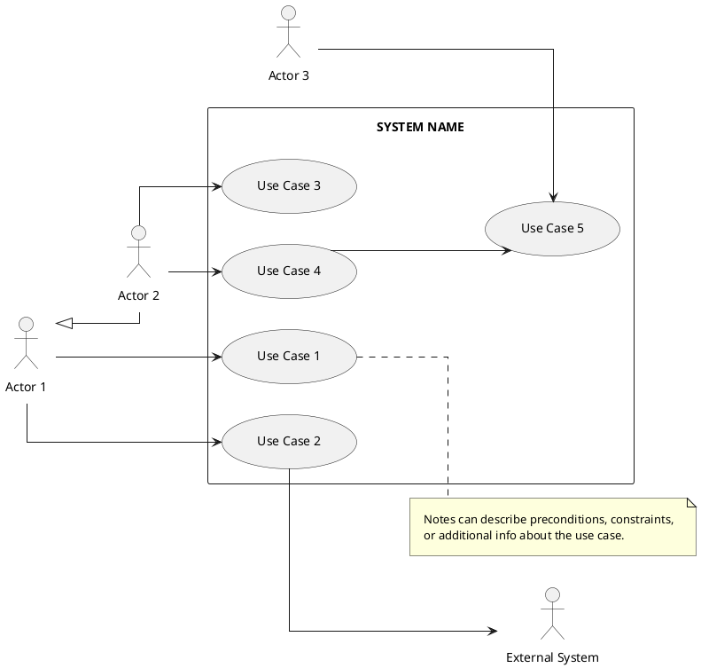
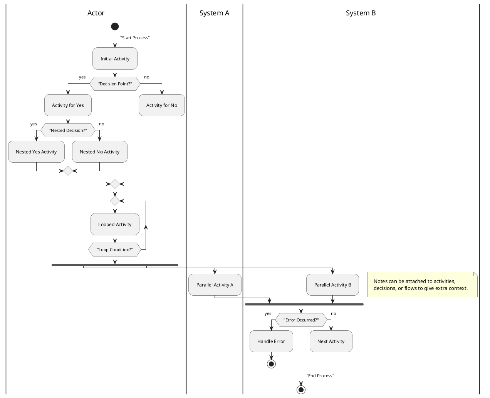
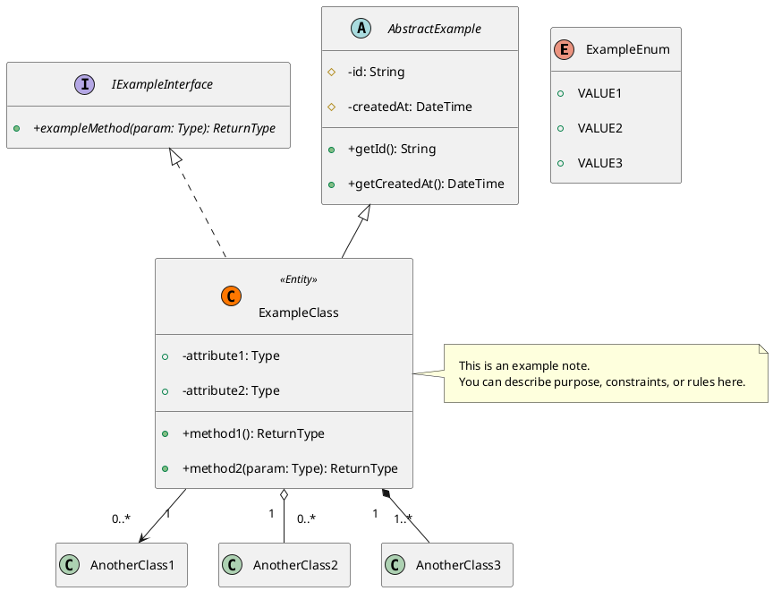
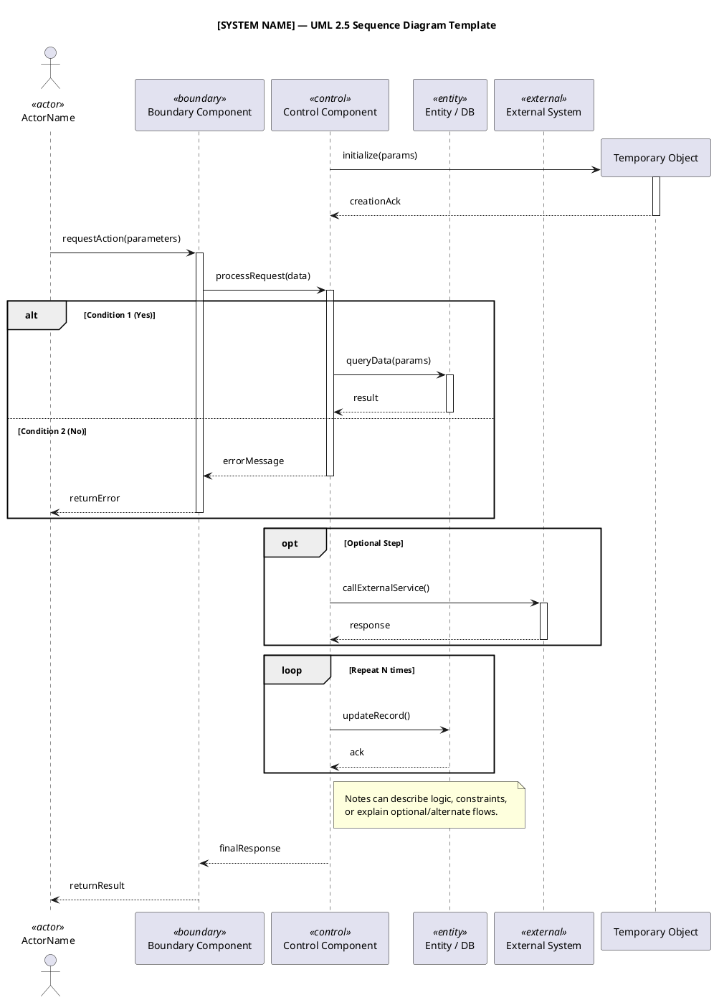
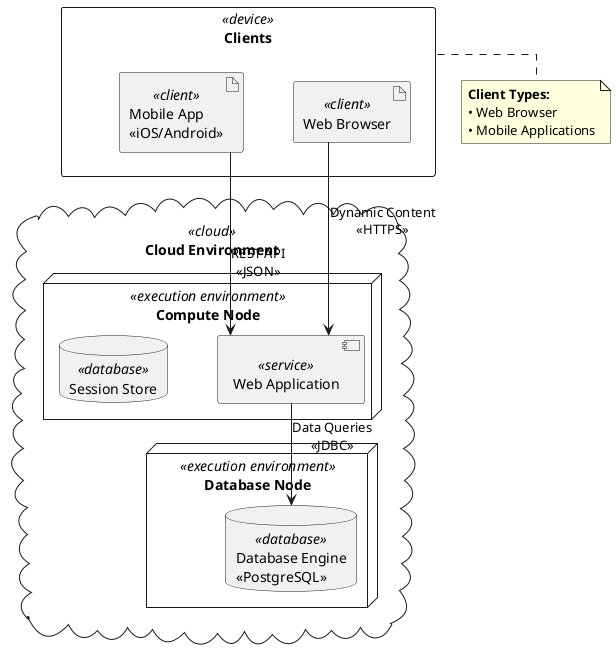

# UML Diagram Repository

This repository contains PlantUML templates (`.puml` files) and their generated PNG images for various UML diagrams.

## Diagram Templates

### 1. Use Case Diagrams




---

### 2. Activity Diagrams




---

### 3. Class Diagrams




---

### 4. Sequence Diagrams




---

### 5. Deployment Diagrams




## How to Use

### Option 1: Quick Preview

1. Copy any diagram code
2. Paste at [PlantText.com](https://www.planttext.com/) for instant rendering

### Option 2: Local Generation

1. [Install PlantUML](https://plantuml.com/download):

   ```bash
   # Requires Java (brew install openjdk / sudo apt install default-jdk)
   curl -L -o plantuml.jar https://github.com/plantuml/plantuml/releases/latest/download/plantuml.jar
   ```

2. Generate diagrams:

   ```bash
   java -jar plantuml.jar -tpng diagram.puml  # PNG output
   java -jar plantuml.jar -tsvg diagram.puml  # SVG output
   ```

### IDE Integration

- **VS Code**: Install "PlantUML" extension by jebbs
- **IntelliJ**: Install "PlantUML Integration" plugin

## Pro Tips

- Use `-checkmetadata` flag for incremental rendering
- Add `-verbose` flag for debugging generation issues
- For large diagrams: `-DPLANTUML_LIMIT_SIZE=8192`

## License

MIT Licensed - See [LICENSE](LICENSE) for details.