# UML Diagrams Repository

This repository contains UML diagrams created with **PlantUML** to illustrate various software design processes. Each `.puml` file represents a different flow or structure, helping to visualize and document software architecture, interaction flows, and other design aspects. These diagrams can be useful for software architects, developers, or anyone looking to understand complex system structures and interactions.

## Repository Overview

This repository currently contains the following `.puml` files:

### 1. **registration_use_case.puml**
A UML use case diagram for a generic user registration and verification flow. It models the interactions involved in user registration, from form display to email verification. Key components include:
- Displaying the registration form
- Sending and verifying email for account validation
- Error handling for invalid verification attempts

### 2. **organization_class_diagram.puml**
A **Class Diagram** representing the structure of an **organization** system. The diagram includes classes like `Person`, `Employee`, `Manager`, `TeamLead`, `Department`, and related concepts such as `Address` and `Payroll`. It showcases:
- Inheritance relationships (e.g., `Employee` and `Manager` inherit from `Person`).
- Composition (e.g., `Department` contains `Employee` objects).
- Dependency (e.g., `Payroll` depends on `EmployeeManager`).
- Event handling with signals and interfaces (e.g., `IEventPublisher` and `onEmployeeAdded` signal).
- Use of interfaces (e.g., `IWorker<T>`).
  
This class diagram models a complex organizational structure, detailing how employees, managers, and various supporting systems interact.

### 3. **sign_in_flow.puml**
A UML sequence diagram detailing the user sign-in process for a generic web application. It illustrates interactions between the user, frontend interface, and backend server components, including:
- Form submission
- Authentication and validation
- Error handling and success flows

### 4. **microservice_architecture.puml**
A UML component diagram representing the architecture of a microservice application hosted on Azure's Service Fabric. It illustrates the interactions between various components, including:
- Microservice code and unit testing
- Service Fabric cluster deployment
- Interaction with multiple Azure services such as storage, security, compute, networking, and monitoring
- API management and real-time communication via WebSocket
- Continuous integration and deployment using Azure DevOps

This repository will grow with additional diagrams, covering more scenarios and design structures over time.

---

## Getting Started

To view and modify these `.puml` files, you can use **PlantUML** with any text editor, or integrate it with an IDE for easier visualization.

### Prerequisites

1. **Java**: PlantUML requires Java to run, so make sure it is installed on your system.
2. **PlantUML**: Install PlantUML on your system or use an IDE that supports PlantUML, such as **Visual Studio Code** with the PlantUML extension.

---

### Cloning the Repository

To get a local copy of this repository, use the following command:

```bash
git clone https://github.com/andikatjacobdennis/UML.git
```

---

## Rendering UML Diagrams

Once you have cloned the repository, you can render the `.puml` files using PlantUML.

### Using the Command Line

1. Open a terminal in the directory containing the `.puml` files.
2. Run the following command to generate a PNG or SVG file for each diagram:

```bash
plantuml sign_in_flow.puml
plantuml registration_use_case.puml
plantuml microservice_architecture.puml
plantuml organization_class_diagram.puml
```

This will generate image files in the same directory which you can open to view the diagrams.

### Using Visual Studio Code

1. Install the [PlantUML extension for VS Code](https://marketplace.visualstudio.com/items?itemName=jebbs.plantuml).
2. Open any `.puml` file (e.g., `sign_in_flow.puml`, `registration_use_case.puml`, `microservice_architecture.puml`, or `organization_class_diagram.puml`) in VS Code.
3. Open the PlantUML preview pane by pressing `Alt + D` (Windows/Linux) or `Cmd + Shift + P` (Mac), then type “PlantUML: Preview Current Diagram”.
4. You should see the rendered UML diagram in real-time.

---

Certainly! Below, I'll include PlantUML code for each UML relationship type along with explanations. You can use these `.puml` code snippets to generate corresponding diagrams in PlantUML.

---

## UML 2.5 Arrow Types and Their Meanings

UML diagrams use a variety of arrows to represent different kinds of relationships, flow of control, and data exchanges. Below is a list of the main arrow types used in UML 2.5 and their associated meanings, along with the corresponding PlantUML code for each type.

### 1. **Solid Line (Association)**
- **Meaning**: Represents a simple relationship between two elements.
- **Usage**: Commonly used in class diagrams to show that two classes are associated in some way.

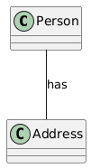 

### 2. **Arrowhead on Solid Line (Directed Association)**
- **Meaning**: Indicates that the association has a direction, i.e., one element sends messages to or influences another.
- **Usage**: Often used in class diagrams where one class knows about or interacts with another.

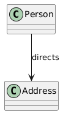 

### 3. **Dashed Line (Dependency)**
- **Meaning**: Represents a dependency between two elements, where one element relies on another.
- **Usage**: Common in class diagrams to indicate that one class depends on another for functionality.

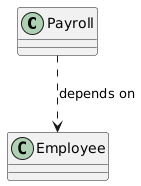 

### 4. **Solid Line with Arrowhead (Generalization)**
- **Meaning**: Indicates inheritance or generalization between classes.
- **Usage**: Used in class diagrams to show that one class (the child) inherits the properties and behaviors of another (the parent).

#### PlantUML Code:
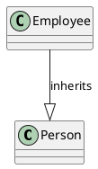

### 5. **Dashed Line with Arrowhead (Realization)**
- **Meaning**: Represents an implementation relationship between an interface and a class or between a class and an abstract method.
- **Usage**: In class diagrams, it shows that a class implements an interface.

#### PlantUML Code:
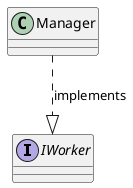

### 6. **Solid Line with Open Arrowhead (Navigability)**
- **Meaning**: Indicates a unidirectional association where one element can navigate to the other.
- **Usage**: Used in class diagrams to show that one class can access or reference another class.

#### PlantUML Code:
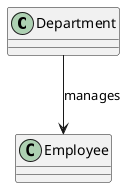

### 7. **Message Arrow (Sequence Diagram)**
- **Meaning**: Represents the flow of messages between objects in a sequence diagram.
- **Usage**: Used in sequence diagrams to show the direction and nature of communication between objects or components.

#### PlantUML Code:
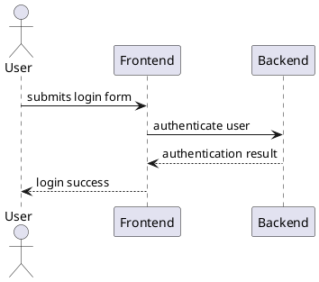

### 8. **Return Arrow (Sequence Diagram)**
- **Meaning**: Indicates the return of control or a value to the calling object in a sequence diagram.
- **Usage**: Typically used in sequence diagrams after a message is sent, to show the return of a result or confirmation.

#### PlantUML Code:
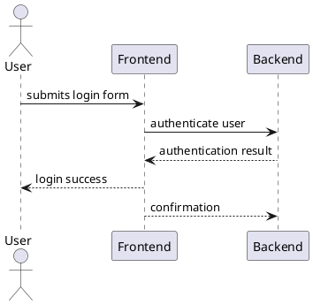

### 9. **Aggregation (Hollow Diamond)**
- **Meaning**: Represents a "whole-part" relationship, where one object (the whole) contains other objects (the parts), but the parts can exist independently.
- **Usage**: Often used in class diagrams to show a collection or grouping of objects that can exist on their own.

#### PlantUML Code:
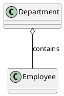

### 10. **Composition (Filled Diamond)**
- **Meaning**: A stronger form of aggregation, indicating a "whole-part" relationship where the part cannot exist without the whole.
- **Usage**: Used in class diagrams to show that one object (the whole) completely owns or controls the lifecycle of another (the part).

#### PlantUML Code:
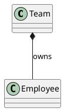

---

### Example of Usage in a Diagram

Here’s how some of these relationships might be used in a **class diagram** of an organization:

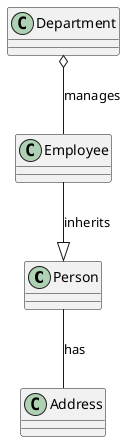

---

## Example Diagram Overview

Here are brief descriptions of the included `.puml` diagrams:

### **1. registration_use_case.puml**

This use case diagram represents the user registration and email verification process for a generic application.

- **Actors**:
  - *Visitor*: Initiates registration and completes verification steps.
  - *Mail Server*: Handles email sending and processing.
  
- **Use Cases**:
  - Display form to the user.
  - Send verification email to confirm the user's address.
  - Verify email address through code entry or URL visit.
  
- **Features**:
  - Shows both primary and alternative verification flows, including constraints for verification completion.
  - Includes conditional handling for incorrect verification attempts.

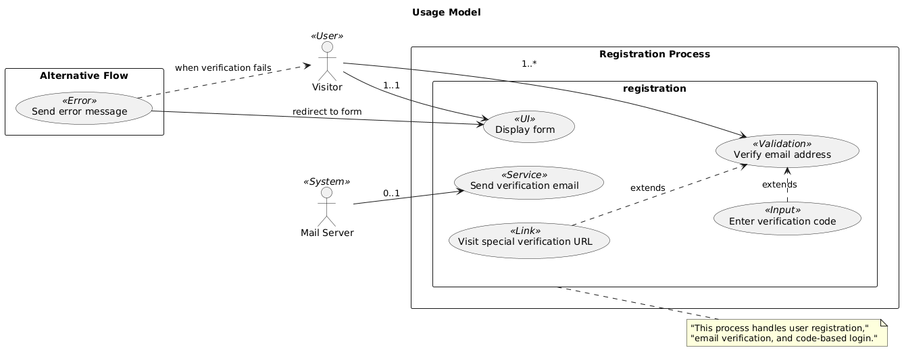  
*Example rendered output of the registration use case.*

---

### **2. organization_class_diagram.puml**

This class diagram illustrates the organizational structure, with classes such as `Person`, `Employee`, `Manager`, `TeamLead`, `Department`, and `Address`, showcasing relationships like inheritance, composition, dependency, and event handling.

- **Classes**:
  - `Person` is an abstract class with attributes like `Name`, `age`, and `salary`, and has methods for age setting and printing employee details.
  - `Employee` and `Manager` inherit from `Person`, with specific methods like `Work()` and employee management capabilities.
  - `Manager` and `TeamLead` are designed to handle employees and work on tasks.
  - `Department` composes `Employee` objects and manages them.
  - `Address` represents where employees live.
  
- **Event Handling**:
  - `Manager` implements `IEventPublisher` to handle employee-related events, such as adding an employee to the team.

  
*Example rendered output of the organization class diagram.*

---

### **3. sign_in_flow.puml**

This sequence diagram depicts the steps in a user sign-in process.

- **Steps**:
  - User submits the sign-in form.
  - Form validation and parameter checking on the client side.
  - Authentication request sent to backend services.
  - Response handling, including success and error messages.

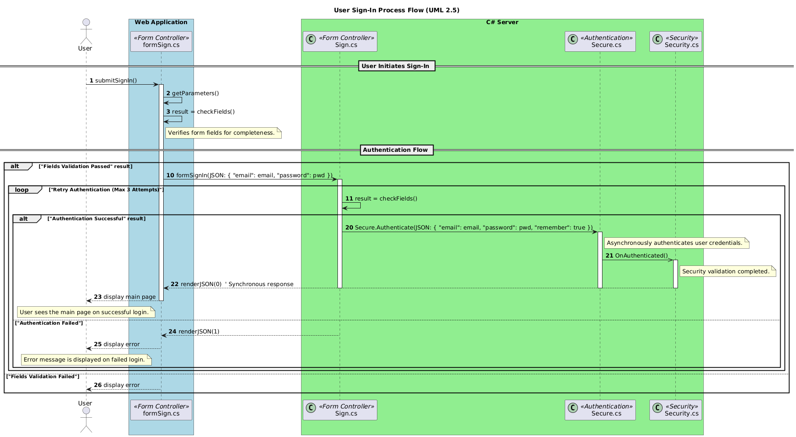  
*Example rendered output of the sign-in flow.*

---

### **4. microservice_architecture.puml**

This component diagram represents a microservice architecture deployed on Azure Service Fabric.

- **Components**:
  - Microservice development, testing, and deployment via Service Fabric.
  - Integration with Azure services such as storage, security (Azure AD, Key Vault), compute (Azure Functions, Container Instances), and more.
  - Use of WebSocket for real-time updates, Message Queues, and Event Topics for event-driven interactions.
  - Monitoring via Azure Monitor and Application Insights.
  - CI/CD pipeline automation using Azure DevOps.

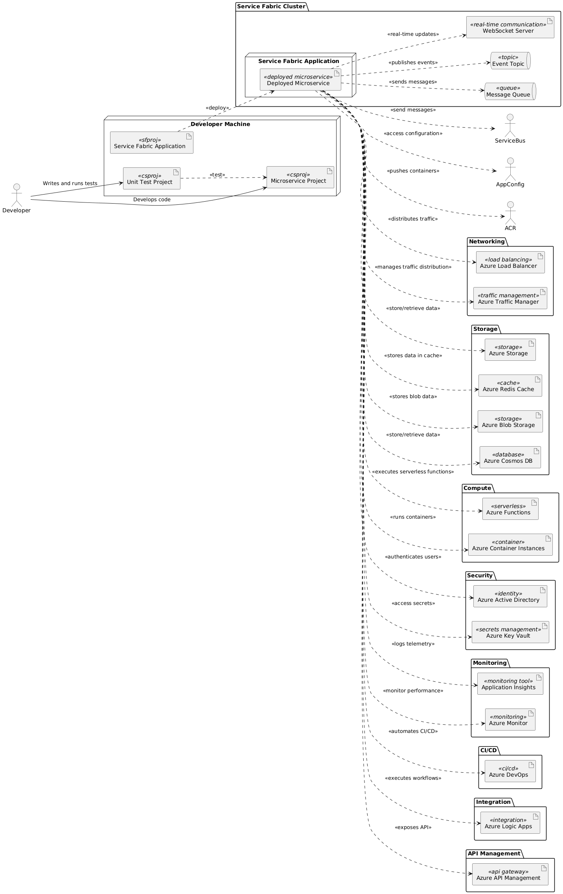  
*Example rendered output of the microservice architecture.*

---

## Contributing

Contributions are welcome! If you want to add or improve a diagram:

1. **Fork** this repository.
2. **Make your changes** or add new `.puml` files.
3. **Submit a pull request** with a description of the update.

We encourage contributions for new diagram types, improvements, or additional comments in existing files!

---

## License

This repository is licensed under the MIT License - see the [LICENSE](LICENSE) file for details.
