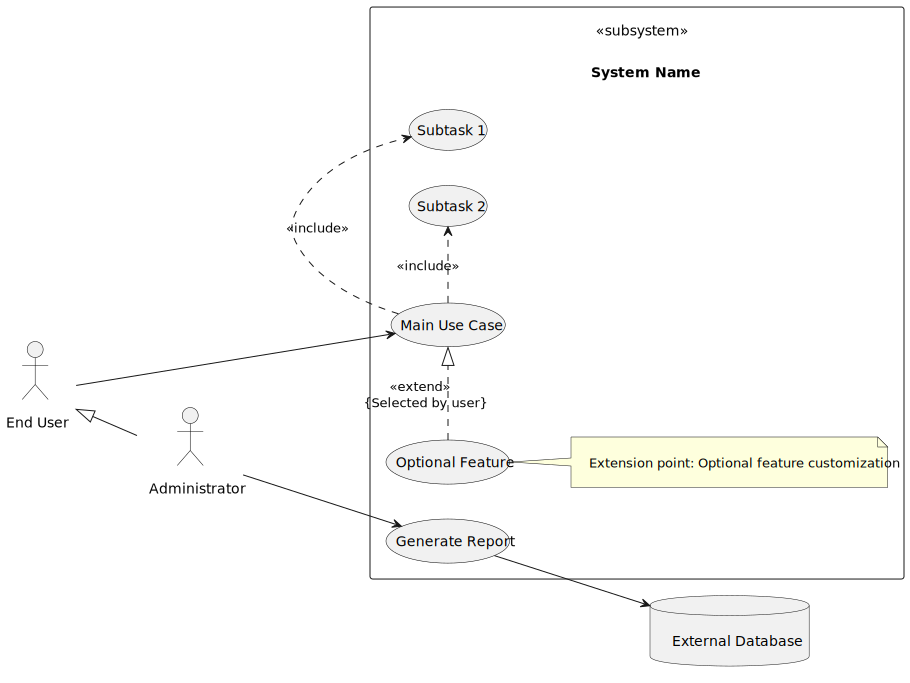
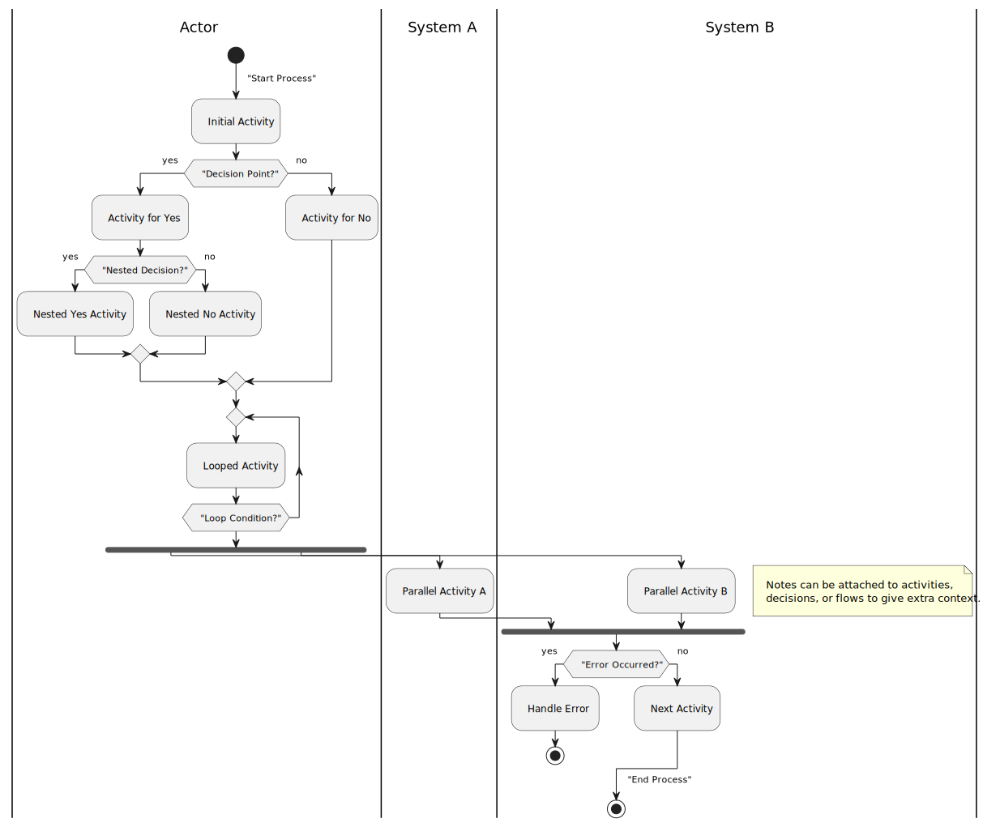
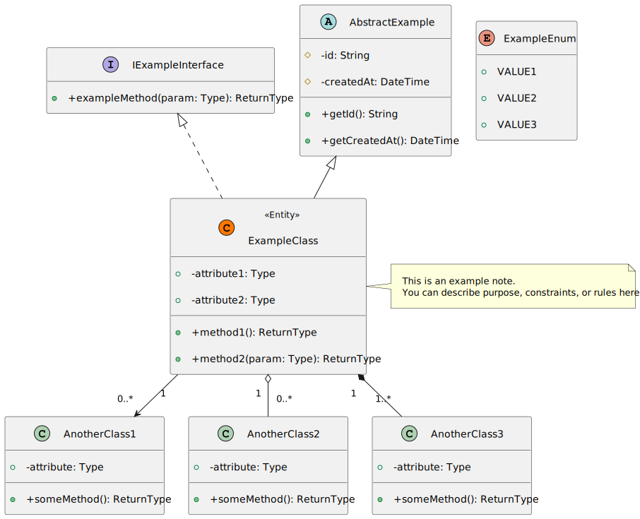
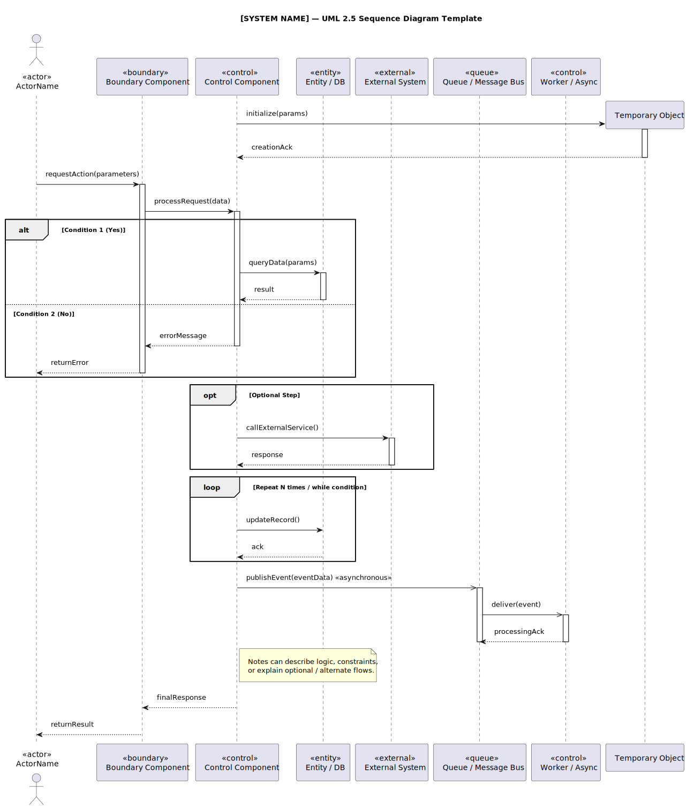

# UML Diagram

This repository contains PlantUML templates (`.puml` files) and their generated images for various UML diagrams.

## Diagram Templates

### 1. Use Case Diagrams



[View Source Code](usecase/plantuml_usecase.puml)

---

### 2. Activity Diagrams



[View Source Code](activity/plantuml_activity.puml)

---

### 3. Class Diagrams



[View Source Code](class/plantuml_class.puml)

---

### 4. Sequence Diagrams



[View Source Code](sequence/plantuml_sequence.puml)

---

### 5. Deployment Diagrams


[View Source Code](deployment/plantuml_deployment.puml)

---

## How to Use

### Option 1: Quick Preview

1. Click any "View Source Code" link above
2. Copy the contents
3. Paste at [https://editor.plantuml.com/](https://editor.plantuml.com/) for instant rendering

### Option 2: Local Generation

1. [Download PlantUML](https://plantuml.com/download):

2. Generate diagrams:

   ```bash
   java -jar plantuml.jar -tpng file.puml  # PNG output
   java -jar plantuml.jar -tsvg file.puml  # SVG output
   ```

### IDE Integration

- **VS Code**: Install "PlantUML" extension
- **IntelliJ**: Install "PlantUML Integration" plugin

## Pro Tips

- Use relative paths in your `.puml` files for includes
- Add `-verbose` flag for debugging
- Set `-DPLANTUML_LIMIT_SIZE=8192` for large diagrams

## License

MIT Licensed - See [LICENSE](LICENSE)
