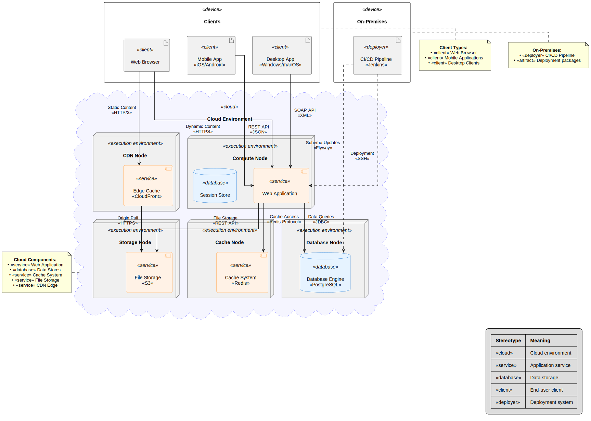

# UML


This repository contains **PlantUML templates (`.puml` files)** along with their generated diagrams for various UML types. It is designed for developers, architects, and analysts to quickly visualize and maintain UML diagrams.

---

## Diagram Templates

### 1. Use Case Diagrams

[](usecase/use-case-diagram.svg)

**Source Code:** [usecase/UseCase.md](usecase/UseCase.md)

---

### 2. Activity Diagrams

[](activity/checkout-diagram.puml)

**Source Code:** [activity/ActivityDiagram.md](activity/ActivityDiagram.md)

---

### 3. Class Diagrams

[](class/shopping-cart-class-diagram.puml)

**Source Code:** [class/ClassDiagram.md](class/ClassDiagram.md)

---

### 4. Sequence Diagrams

[](sequence/checkout-process-sequence-diagram.puml)

**Source Code:** [sequence/SequenceDiagram.md](sequence/SequenceDiagram.md)

---

### 5. Deployment Diagrams

[](deployment/plantuml_deployment.puml)

**Source Code:** [deployment/plantuml\_deployment.puml](deployment/plantuml_deployment.puml)

---

## Usage Guide

### Option 1: Quick Online Preview

1. Click on any **diagram thumbnail** above or its **Source Code** link.
2. Copy the `.puml` content.
3. Paste into [PlantUML Online Editor](https://editor.plantuml.com/) for instant rendering.

### Option 2: Local Diagram Generation

1. [Download PlantUML](https://plantuml.com/download).
2. Generate diagrams locally:

```bash
java -jar plantuml.jar -tpng file.puml  # PNG output
java -jar plantuml.jar -tsvg file.puml  # SVG output
```

---

## IDE Integration

| IDE          | Integration Method                                                                                        |
| ------------ | --------------------------------------------------------------------------------------------------------- |
| **VS Code**  | Install the [PlantUML Extension](https://marketplace.visualstudio.com/items?itemName=jebbs.plantuml)      |

> **Tip:** Most IDE plugins support live preview, auto-refresh, and export to PNG/SVG.

---

## Best Practices

* Use **relative paths** in `.puml` files for includes.
* Enable `-verbose` for debugging complex diagrams.
* For large diagrams, set `-DPLANTUML_LIMIT_SIZE=8192`.
* Keep diagrams modular by separating complex sections into multiple `.puml` files.

---

## License

This repository is licensed under the **MIT License**. See [LICENSE](LICENSE) for details.
