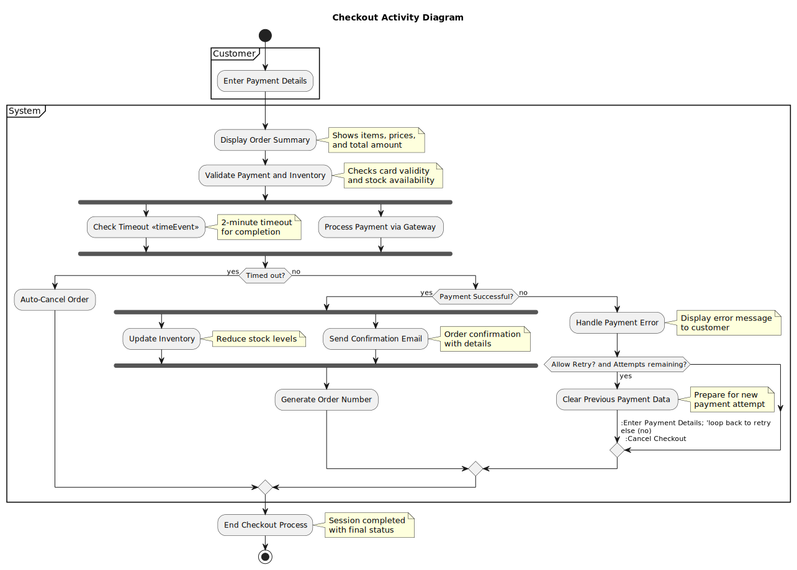

# UML


This repository provides comprehensive **UML 2.5.1 diagram documentation** with detailed explanations, visual references, and ready-to-use PlantUML templates. Designed for **software developers, system architects, and business analysts**, it supports efficient modeling, documentation, and maintenance of software systems using industry-standard UML conventions.

## Covered Diagram Types

- **Use Case Diagrams** – System functionality and actor interactions
- **Activity Diagrams** – Business workflows and procedural logic
- **Class Diagrams** – Static structure with interfaces, packages, and relationships
- **Sequence Diagrams** – Dynamic object interactions and process flows
- **Deployment Diagrams** – Physical infrastructure and runtime architecture

---

## Diagram Documentation

### 1. Use Case Diagrams

[](usecase/UseCase.md)

**Documentation:** [UseCase.md](usecase/UseCase.md) – Comprehensive guide covering actors, use cases, relationships, and structured scenario descriptions.

---

### 2. Activity Diagrams

[](activity/ActivityDiagram.md)

**Documentation:** [ActivityDiagram.md](activity/ActivityDiagram.md) – Step-by-step workflow modeling including decisions, parallelism, time events, and swimlanes.

---

### 3. Class Diagrams

[](class/ClassDiagram.md)

**Documentation:** [ClassDiagram.md](class/ClassDiagram.md) – In-depth exploration of class structures, interfaces, enumerations, packages, and relational semantics.

---

### 4. Sequence Diagrams

[](sequence/SequenceDiagram.md)

**Documentation:** [SequenceDiagram.md](sequence/SequenceDiagram.md) – Detailed interaction modeling for the checkout process, including interfaces, lifelines, and combined fragments.

---

### 5. Deployment Diagrams

[](deployment/DeploymentDiagram.md)

**Documentation:** [DeploymentDiagram.md](deployment/DeploymentDiagram.md) – Cloud-based deployment architecture with nodes, services, external integrations, and CI/CD pipeline.

---

## Usage Guide

### Online Preview
1. Click on any diagram image or documentation link above.
2. Review detailed explanations, visual examples, and embedded PlantUML code.
3. Use the templates directly or adapt them for your projects.

### Local Generation
1. [Download PlantUML](https://plantuml.com/download) (requires Java).
2. Extract PlantUML code from Markdown files or use provided `.puml` files.
3. Generate diagrams using the command line:

```bash
java -jar plantuml.jar -tpng diagram.puml    # PNG output
java -jar plantuml.jar -tsvg diagram.puml    # SVG output
```

---

## 🔧 IDE Integration

| Environment | Plugin |
|-------------|--------|
| **VS Code** | [PlantUML Extension](https://marketplace.visualstudio.com/items?itemName=jebbs.plantuml) |

---

## Best Practices

- Maintain consistent naming conventions and directory structures.
- Use relative paths for image references in Markdown files.
- For complex diagrams, consider using separate `.puml` files for better maintainability.
- Validate diagrams against UML 2.5.1 specifications for semantic accuracy.

---

## License

This repository is licensed under the **MIT License**. See [LICENSE](LICENSE) for full details.

---

## Contributing

Contributions are welcome! Please feel free to submit issues, suggest enhancements, or open pull requests to improve this repository.
