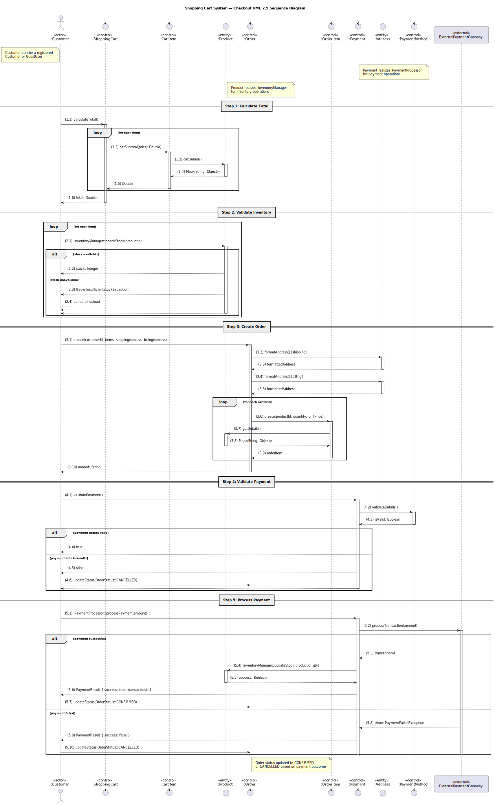

# UML


This repository contains **UML diagram documentation**, including `.md` files with explanations, images, and PlantUML templates for multiple diagram types. It is designed for **developers, architects, and analysts** to visualize, document, and maintain UML models efficiently.

It covers:

* **Use Case Diagrams** – system functionality and actors
* **Activity Diagrams** – workflows and procedural logic
* **Class Diagrams** – static structure, interfaces, and packages
* **Sequence Diagrams** – dynamic interactions and process flows
* **Deployment Diagrams** – physical architecture and runtime nodes

---

## Diagram Documentation

### 1. Use Case Diagrams

[](usecase/UseCase.md)

**Documentation:** [usecase/UseCase.md](usecase/UseCase.md) – Explains actors, use cases, and scenarios with supporting images.

---

### 2. Activity Diagrams

[](activity/ActivityDiagram.md)

**Documentation:** [activity/ActivityDiagram.md](activity/ActivityDiagram.md) – Details workflow steps, decisions, parallel actions, and time events.

---

### 3. Class Diagrams

[](class/ClassDiagram.md)

**Documentation:** [class/ClassDiagram.md](class/ClassDiagram.md) – Shows static structure, classes, attributes, operations, interfaces, packages, and relationships.

---

### 4. Sequence Diagrams

[](sequence/SequenceDiagram.md)

**Documentation:** [sequence/SequenceDiagram.md](sequence/SequenceDiagram.md) – Illustrates object interactions during the Checkout process, including interfaces and conditional flows.

---

### 5. Deployment Diagrams

[](deployment/DeploymentDiagram.md)

**Documentation:** [deployment/DeploymentDiagram.md](deployment/DeploymentDiagram.md) – Describes the cloud-based deployment architecture, including nodes, services, clients, CI/CD pipeline, and external integrations.

---

## Usage Guide

### Option 1: Quick Online Preview

1. Click any **diagram image** or its **Documentation** link.
2. Review the detailed explanation, images, and examples.
3. Access the PlantUML template inside the `.md` file if you want to generate or edit diagrams.

### Option 2: Local Diagram Generation

1. [Download PlantUML](https://plantuml.com/download).
2. Use the `.puml` snippets from each `.md` file to generate diagrams locally:

```bash
java -jar plantuml.jar -tpng diagram.puml  # PNG output
java -jar plantuml.jar -tsvg diagram.puml  # SVG output
```

---

## IDE Integration

| IDE         | Integration Method                                                                                   |
| ----------- | ---------------------------------------------------------------------------------------------------- |
| **VS Code** | Install the [PlantUML Extension](https://marketplace.visualstudio.com/items?itemName=jebbs.plantuml) |

> **Tip:** Most IDE plugins support live preview, auto-refresh, and export to PNG/SVG.

---

## Best Practices

* Keep **documentation `.md` files** organized by diagram type.
* Reference images inline to improve readability.
* For large diagrams, generate diagrams using separate `.puml` files to maintain clarity.
* Use **relative paths** in `.md` files for images and includes.

---

## License

This repository is licensed under the **MIT License**. See [LICENSE](LICENSE) for details.
