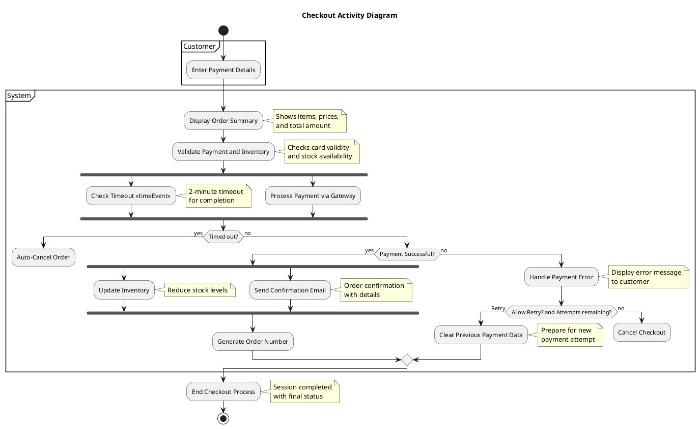

# UML 2.5.1 Activity Diagram Tutorial: Modeling a Checkout Process

This module provides a comprehensive guide to creating an Activity Diagram adhering to UML 2.5.1 standards (as defined by the Object Management Group specification, formal/2017-12-05, dated December 2017). Using the shopping cart system's checkout process as a practical example, Activity Diagrams excel at visualizing the dynamic flow of actions, decisions, and parallel tasks within a system. This tutorial builds on the prior Use Case Diagram module and is designed for developers, analysts, and designers seeking to document and refine procedural workflows. Imagine it as directing a well-orchestrated play where each actor (system component) follows a scripted flow with timely cues and exits!

**Pro Tip:** Leverage UML 2.5.1's enhanced features like time events and swimlanes, detailed in the normative spec at https://www.omg.org/spec/UML/, for robust modeling.

---

## Introduction to Activity Diagrams

Activity Diagrams depict the sequence of activities, decision points, and concurrent executions in a system, making them ideal for detailing workflows like the "Checkout" process. UML 2.5.1 introduces advanced constructs such as time events and interruptible regions, ensuring precise representation of real-time behaviors and responsibilities. These diagrams focus on the "how" of system operations, complementing the "what" of Use Case Diagrams.

Tools like PlantUML facilitate diagram generation and integration into documentation or repositories, enhancing team collaboration.

---

## Step 0: Transition from Use Case Diagram

Begin by aligning the Activity Diagram with a specific use case:

1.  Identify the target use case (e.g., "Checkout") and its actors.
2.  Extract main flows, alternative paths, and exceptions from the use case.
3.  Note triggers like timeouts to incorporate dynamic elements.

This step ensures the diagram reflects the use case's intent and supports traceability.

---

## Step 1: Analyze the Checkout Process

Break down the checkout process into actionable steps, including conditions and parallels:

-   Customer enters payment details.
-   System displays the order summary and validates payment/inventory.
-   A 2-minute timeout checks for inactivity.
-   If valid and not timed out: process payment, update inventory, and send confirmation.
-   If invalid or timed out: handle errors or cancel the order, with retry options if attempts remain.

Incorporate real-world scenarios like payment failures or stock issues for a practical model.

---

## Step 2: Define Initial and Final Nodes

-   **Initial Node**: A filled circle marks the start (e.g., customer initiates checkout).
-   **Activity Final Node**: A circle with a smaller filled circle inside signifies process completion (e.g., checkout ends with success or full cancellation).
-   **Flow Final Node**: A circle with an 'X' terminates a specific path (e.g., order cancellation due to timeout).

**Associations**:

-   The **Initial Node** links to the first action ("Display Order Summary") via a control flow.
-   The **Activity Final Node** is reached from the last action or join ("End Checkout Process").
-   **Flow Final Node** connects from termination points like "Auto-Cancel Order" or "Cancel Checkout".

---

## Step 3: Specify Actions

Actions are rounded rectangles representing discrete tasks:

-   Enter Payment Details
-   Display Order Summary
-   Validate Payment and Inventory
-   Process Payment via Gateway
-   Update Inventory
-   Send Confirmation Email
-   Handle Payment Error
-   Auto-Cancel Order
-   Cancel Checkout
-   Generate Order Number
-   Clear Previous Payment Data

Use clear, action-oriented labels to guide the workflow narrative.

---

## Step 4: Implement Control and Object Flows

-   **Control Flows**: Solid arrows sequence actions.
-   **Object Flows**: Solid arrows with object nodes (e.g., [Order Details]) pass data.

Example: "Enter Payment Details" flows to "Validate Payment and Inventory" with [Payment Info] as an object.

---

## Step 5: Add Decision and Merge Nodes

-   **Decision Node**: Diamond with guards (e.g., [Timed out?], [Payment Successful?]) for branching.
-   **Merge Node**: Diamond to reunite paths (e.g., after error handling or retry decisions).

Example: After validation, a decision on [Payment Successful?] branches to success or error paths, merging back for retries.

---

## Step 6: Use Forks and Joins for Parallelism

-   **Fork Node**: Bar splits flows into parallel tasks.
-   **Join Node**: Bar synchronizes them.

Example: After successful payment, fork to "Update Inventory" and "Send Confirmation Email", then join before "Generate Order Number".

---

## Step 7: Incorporate Time Events

-   **Accept Time Event**: Hourglass symbol for time-based triggers (e.g., "Check Timeout" after 2 minutes).

A time event after "Enter Payment Details" triggers "Auto-Cancel Order" if inactive, enhancing realism for e-commerce timeouts.

---

## Step 8: Apply Swimlanes

Organize the diagram with swimlanes to assign responsibilities:

-   **Customer**: "Enter Payment Details".
-   **System**: "Display Order Summary," "Validate Payment and Inventory," "Check Timeout," "Handle Payment Error," "Generate Order Number," "End Checkout Process".
-   **Payment Gateway**: "Process Payment via Gateway".

Swimlanes clarify who or what performs each action, improving readability.

---

## Step 9: Validate the Diagram

Verify that:

-   All flows align with the use case and UML 2.5.1 semantics.
-   Swimlanes correctly assign responsibilities.
-   Initial, final, and flow final nodes are properly connected.

Walk through the diagram to ensure logical consistency and completeness.

---

## Step 10: Document Activity Descriptions

Provide a detailed narrative in a table format.

| **Activity Name**        | Checkout                                                                                                                              |
| :----------------------- | :------------------------------------------------------------------------------------------------------------------------------------ |
| **Associated Use Case**  | Checkout                                                                                                                              |
| **Description**          | Manages the checkout process with payment validation, parallel updates, and timeout handling.                                         |
| **Preconditions**        | Cart contains items; checkout initiated.                                                                                              |
| **Postconditions**       | Order completed or canceled with appropriate status.                                                                                  |
| **Main Flow**            | 1. Initial Node → Display Order Summary (System).   2. Enter Payment Details (Customer).   3. Validate Payment and Inventory (System).   4. Check Timeout (System) - 2-minute event.   5. Decision: [Timed out?] → Auto-Cancel Order (Flow Final); [not timed out] → continue.   6. Decision: [Payment Successful?] → Fork (Update Inventory \|\| Send Confirmation Email) → Join → Generate Order Number; [not successful] → Handle Payment Error.   7. Decision: [Allow Retry? and Attempts remaining?] → Clear Previous Payment Data → Retry; [no] → Cancel Checkout (Flow Final).   8. Activity Final Node via End Checkout Process. |
| **Alternative Flows**    | **A1: Retry After Error** - Loops back to "Enter Payment Details" if retries available.   **A2: Inventory Issue** - Handled in validation, notifies and merges to cancellation if needed. |
| **Exceptions**           | **E1: Timeout** - Triggers Auto-Cancel.   **E2: Gateway Failure** - Leads to Handle Payment Error.                                                               |
| **Notes**                | Uses swimlanes for clarity; object flows like [Order Details] enhance data tracking. Time events reflect real-world constraints.      |

---

## Step 11: Example PlantUML Representation

Below is the PlantUML script for the "Checkout" Activity Diagram.

