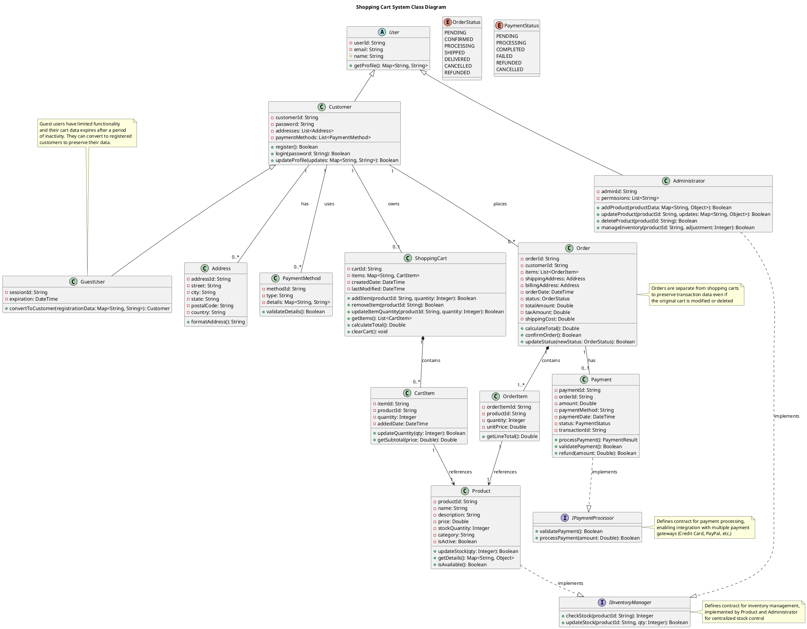

# UML 2.5.1 Class Diagram Tutorial: Modeling a Shopping Cart System with Interfaces
This module provides a comprehensive guide to creating a Class Diagram adhering to UML 2.5.1 standards (as defined by the Object Management Group specification, formal/2017-12-05, dated December 2017). Using the **shopping cart system** as a practical example, this tutorial models the system's static structure, incorporating **interfaces**, **realization** relationships, and reviewer feedback to define contracts for key behaviors. Class Diagrams model classes, attributes, operations, and relationships, building on the prior Use Case, Activity, and Class Diagram modules. This tutorial is designed for developers, analysts, and designers to document and design the system's data and behavior effectively.

**Pro Tip:** Refer to the UML 2.5.1 specification at [https://www.omg.org/spec/UML/](https://www.omg.org/spec/UML/) for detailed insights into interfaces, realization, abstract classes, and enums to ensure modeling precision.

---

## Introduction to Class Diagrams and Interfaces
Class Diagrams in UML 2.5.1 depict the static structure of a system by defining classes, their attributes, operations, and relationships (e.g., association, inheritance, composition). **Interfaces** specify contracts of operations that classes must implement, promoting modularity. The **realization** relationship (`..|>`) indicates that a class implements an interface’s operations. **Abstract classes** provide shared attributes and operations, while **enums** define fixed sets of values. For the shopping cart system, this diagram incorporates interfaces for payment and inventory management, an abstract `User` class, and enums for order and payment statuses, aligning with the reviewer’s updated structure.

Tools like PlantUML enable programmatic diagram generation, ideal for embedding in documentation, GitHub Markdown files, or wikis.

---

## Step 0: Transition from Prior UML Diagrams
To ensure traceability, align the Class Diagram with prior UML diagrams and reviewer feedback:
1. Review the **Use Case Diagram** to identify entities (e.g., Customer, Guest User, Administrator) and functionalities (e.g., Checkout, Manage Products).
2. Extract structural elements from the **Activity Diagram** (e.g., Checkout involves Order, Payment, ShoppingCart).
3. Map dynamic behaviors (e.g., "Process Payment," "Validate Inventory") to class operations and interfaces.
4. Incorporate reviewer changes: abstract `User` class, new classes (`Address`, `PaymentMethod`, `OrderItem`), enums (`OrderStatus`, `PaymentStatus`), and refined attributes/operations.
5. Retain interfaces (`IPaymentProcessor`, `IInventoryManager`) for modularity.
This step ensures the diagram reflects functional, behavioral, and structural requirements.

---

## Step 1: Analyze System Requirements
Based on the Use Case, Activity Diagrams, and reviewer’s updates, identify:
- **Entities**: User (abstract), Customer, Guest User, Administrator, Shopping Cart, Cart Item, Product, Order, Order Item, Payment, Address, Payment Method.
- **Functionalities**:
  - Customer: Register, login, manage cart, place orders, manage addresses and payment methods.
  - Guest User: Temporary session-based cart, option to convert to Customer.
  - Administrator: Manage products and inventory.
  - Shopping Cart: Add/remove/update items, calculate total, clear cart.
  - Order: Finalize cart, process payment, track status.
  - Payment: Validate and process payments, handle refunds.
- **Data**:
  - Customer: ID, email, password, addresses, payment methods.
  - Shopping Cart: Items (as Map), creation/modification dates.
  - Product: ID, name, price, stock, category.
  - Order: ID, customer, items, addresses, status, costs.
  - Payment: ID, amount, method, status, transaction ID.
- **Interfaces**:
  - `IPaymentProcessor`: Defines `validatePayment()`, `processPayment()`.
  - `IInventoryManager`: Defines `checkStock()`, `updateStock()`.
- **Enums**: `OrderStatus` (e.g., PENDING, CONFIRMED), `PaymentStatus` (e.g., COMPLETED, FAILED).
The Class Diagram will model these entities, their interactions, and interface implementations.

---

## Step 2: Identify Classes, Interfaces, and Enums
Classes represent entities, interfaces define contracts, and enums define fixed values:
- **Classes**:
  - **User** (abstract): Shared attributes/operations for Customer and Administrator.
  - **Customer**: Manages user data, cart, orders, addresses, payment methods.
  - **GuestUser**: Temporary user with session-based cart.
  - **ShoppingCart**: Manages cart items and calculations.
  - **CartItem**: Represents a product in the cart with quantity.
  - **Product**: Stores product details and inventory.
  - **Order**: Captures finalized cart and payment details.
  - **OrderItem**: Represents a product in an order.
  - **Payment**: Manages payment processing and refunds.
  - **Administrator**: Manages products and inventory.
  - **Address**: Stores shipping/billing address details.
  - **PaymentMethod**: Stores payment method details.
- **Interfaces**:
  - **IPaymentProcessor**: Specifies payment operations (implemented by Payment).
  - **IInventoryManager**: Specifies inventory operations (implemented by Product, Administrator).
- **Enums**:
  - **OrderStatus**: Defines order states (e.g., PENDING, SHIPPED).
  - **PaymentStatus**: Defines payment states (e.g., COMPLETED, FAILED).

**Best Practice**: Use singular class names (e.g., "Customer"), prefix interfaces with "I" (e.g., `IPaymentProcessor`), and use clear enum names.

---

## Step 3: Define Attributes, Operations, and Interface Operations
- **Attributes**: Data fields with types and visibility (`-` private, `#` protected, `+` public). Example: `Customer` has `-customerId: String`, `-addresses: List<Address>`.
- **Operations**: Methods reflecting behaviors. Example: `ShoppingCart` has `+addItem(productId: String, quantity: Integer): Boolean`.
- **Interface Operations**: Abstract methods. Example: `IPaymentProcessor` has `+processPayment(amount: Double): Boolean`.
- **Enum Values**: Fixed values for states. Example: `OrderStatus` has `PENDING`, `CONFIRMED`.

---

## Step 4: Establish Relationships
Use UML 2.5.1 relationships:
- **Association**: Solid line for interaction (e.g., `Customer "1" -- "0..1" ShoppingCart`).
- **Generalization**: Solid line with hollow arrow (`<|--`) for inheritance (e.g., `Customer <|-- User`).
- **Composition**: Solid diamond arrow (`*--`) for strong ownership (e.g., `ShoppingCart "1" *-- "0..*" CartItem`).
- **Realization**: Dashed line with hollow arrow (`..|>`) for interface implementation (e.g., `Payment ..|> IPaymentProcessor`).
- **Dependency**: Dashed arrow (not used, as associations suffice).

---

## Step 5: Add Multiplicity
Specify instance counts:
- `1`: Exactly one (e.g., `Order "1" -- "0..1" Payment`).
- `0..1`: Zero or one (e.g., `Customer "1" -- "0..1" ShoppingCart`).
- `0..*`: Zero or many (e.g., `Customer "1" -- "0..*" Order`).
- `1..*`: One or many (e.g., `Order "1" *-- "1..*" OrderItem`).

---

## Step 6: Incorporate Notes
Add notes to clarify:
- `GuestUser`’s session-based nature and conversion option.
- Interface roles (e.g., `IPaymentProcessor` supports multiple gateways).
- `Order`’s separation from `ShoppingCart` for data persistence.

---

## Step 7: Validate the Diagram
Ensure:
- Classes, interfaces, and enums align with use cases (e.g., "Checkout" involves Order, Payment) and activities (e.g., "Process Payment" maps to `IPaymentProcessor`).
- Relationships reflect system behavior (e.g., realization for interfaces, composition for CartItem).
- Attributes and operations cover requirements (e.g., inventory management, payment refunds).
- UML 2.5.1 compliance (correct visibility, multiplicity, realization).
Walk through with stakeholders to validate and iterate.

---

## Step 8: Document Class and Interface Descriptions
Below are example descriptions for the `Order` class and `IPaymentProcessor` interface:

| **Name** | Order (Class) |
|----------|---------------|
| **Description** | Represents a finalized purchase, containing order items, addresses, payment, and status. |
| **Attributes** | `-orderId: String` (unique identifier) `-customerId: String` (ordering customer) `-items: List<OrderItem>` (ordered products) `-shippingAddress: Address` (delivery address) `-billingAddress: Address` (billing address) `-orderDate: DateTime` (order timestamp) `-status: OrderStatus` (order state) `-totalAmount: Double` (total cost) `-taxAmount: Double` (tax cost) `-shippingCost: Double` (shipping cost) |
| **Operations** | `+calculateTotal(): Double` (computes total cost) `+confirmOrder(): Boolean` (finalizes order) `+updateStatus(newStatus: OrderStatus): Boolean` (updates order state) |
| **Associations** | `Order "1" *-- "1..*" OrderItem` (contains) `OrderItem "1" --> "1" Product` (references) `Order "1" -- "0..1" Payment` (has) |
| **Notes** | Separates from ShoppingCart to preserve transaction data; status uses OrderStatus enum. |

| **Name** | IPaymentProcessor (Interface) |
|----------|-----------------------------|
| **Description** | Defines a contract for payment validation and processing, implemented by Payment. |
| **Operations** | `+validatePayment(): Boolean` (checks payment validity) `+processPayment(amount: Double): Boolean` (processes payment via gateway) |
| **Associations** | `Payment ..|> IPaymentProcessor` (realized by Payment) |
| **Notes** | Supports integration with multiple payment gateways (e.g., credit card, PayPal). |

Document other classes (e.g., Customer, ShoppingCart) and interfaces (e.g., `IInventoryManager`) similarly.

---

## Step 9: Example PlantUML Representation

Below is the updated PlantUML script incorporating the reviewer’s changes, including interfaces, abstract class, enums, and new classes.

---

## Step 10: Rendering the Class Diagram
To visualize the diagram:
- Copy the PlantUML script into an online renderer like [PlantUML Server](http://www.plantuml.com/plantuml).
- Use IDE plugins (e.g., VS Code with PlantUML extension) or a standalone PlantUML JAR.
The rendered diagram will display:
- Classes, interfaces, and enums as rectangles, with interfaces marked by `interface` and enums by `enum`.
- Compartments for attributes and operations.
- Relationships (associations, generalization, composition, realization) with appropriate symbols.
- Notes clarifying key aspects (e.g., GuestUser’s role, interface contracts).

---

## Step 11: Best Practices and Validation
- **Alignment**: Ensure classes, interfaces, and enums map to use cases (e.g., "Checkout" involves Order, Payment) and activities (e.g., "Process Payment" maps to `IPaymentProcessor`).
- **Clarity**: Keep the diagram uncluttered by organizing classes logically and using notes for clarity.
- **Completeness**: Verify all attributes, operations, and interfaces cover requirements (e.g., payment refunds, inventory management).
- **UML 2.5.1 Compliance**: Confirm correct use of visibility (`-`, `#`, `+`), multiplicity, realization, and enum notation per the OMG specification.
Walk through with stakeholders to validate accuracy and iterate as needed.

---

## Additional Notes
- **Extensibility**: The diagram can be extended with additional interfaces (e.g., `IDiscountManager` for "Apply Discount") or classes as requirements evolve.
- **Integration**: This Class Diagram integrates with the prior Use Case Diagram (actors and use cases), Activity Diagram (Checkout workflow), and previous Class Diagram (core entities).
- **Interfaces and Enums**: `IPaymentProcessor`, `IInventoryManager`, `OrderStatus`, and `PaymentStatus` enhance modularity and clarity.
- **Tooling**: Use PlantUML for collaborative editing in repositories, or export to SVG/PNG for documentation.
