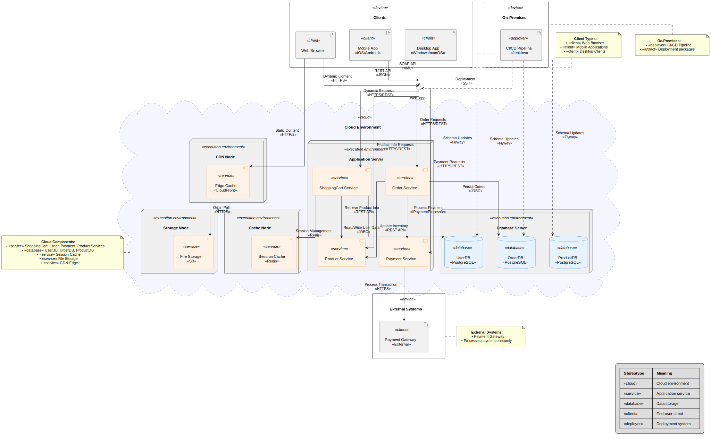

# UML 2.5.1 Deployment Diagram Tutorial: Shopping Cart System

This tutorial provides a detailed guide to creating a **Deployment Diagram** compliant with UML 2.5.1 standards (Object Management Group specification, formal/2017-12-05, December 2017) for the **Shopping Cart System**. Deployment Diagrams describe the **physical architecture** of the system: nodes, execution environments, artifacts, and their communication.

**Pro Tip:** Deployment diagrams are ideal for visualizing cloud architectures, load balancing, caching, database replication, and external integrations such as payment gateways.

---

## Introduction to Deployment Diagrams

Deployment Diagrams model the **runtime physical structure** of a system:

* **Nodes**: Physical hardware or virtualized environments (servers, containers, cloud nodes)
* **Artifacts**: Deployable software units (JARs, WARs, binaries)
* **Components/Services**: Deployed applications and microservices
* **Databases**: Persistent storage
* **Clients**: Users or external systems interacting with deployed nodes
* **Communication Paths**: Network protocols and interface contracts

In UML 2.5.1, **stereotypes** like `<<cloud>>`, `<<service>>`, `<<database>>`, `<<client>>`, and `<<deployer>>` clarify the purpose of each node or artifact.

---

## Step 0: Align with Prior UML Diagrams

Ensure traceability:

1. **Use Case Diagram**: Identifies actors (Customer, GuestUser, Administrator) and the Checkout functionality.
2. **Activity Diagram**: Defines process steps like cart validation, order creation, payment, and inventory updates.
3. **Class Diagram**: Defines system elements, interfaces (`IPaymentProcessor`, `IInventoryManager`), and packages (User, Cart, Product, Order Management).
4. **Sequence Diagram**: Shows dynamic interactions during Checkout, mapping operations to components like `ShoppingCart Service` and `Payment Service`.

Deployment diagrams show **where these classes, services, and artifacts reside in the runtime infrastructure**.

---

## Step 1: Identify Nodes and Execution Environments

Nodes represent **physical or virtual execution environments**:

* **Cloud Environment**: The main infrastructure

  * **Application Server Node**: Hosts services (`ShoppingCart Service`, `Order Service`, `Payment Service`, `Product Service`)
  * **Database Server Node**: Stores persistent data (`UserDB`, `OrderDB`, `ProductDB`)
  * **Cache Node**: Handles session data and caching (`Redis`)
  * **Storage Node**: Stores files and static content (`S3`)
  * **CDN Node**: Edge caching for static assets (`CloudFront`)
* **External Systems**: Payment Gateway for transaction processing
* **On-Premises**: CI/CD pipeline for deployment and database schema updates
* **Clients**: Web browser, mobile app, desktop client

---

## Step 2: Define Artifacts and Services

Artifacts are **deployable software units**, typically realized as services:

* **ShoppingCart Service**: Handles cart operations
* **Order Service**: Processes orders and persists order data
* **Payment Service**: Realizes `IPaymentProcessor` for payment validation and processing
* **Product Service**: Realizes `IInventoryManager` for inventory checks and updates
* **Session Cache**: Maintains active sessions using `Redis`
* **File Storage**: Stores user-uploaded files and system assets
* **Edge Cache / CDN**: Accelerates content delivery for static files

---

## Step 3: Identify Databases and Storage

Persistent storage is critical:

* **UserDB**: Stores user information (`Customer`, `GuestUser`, `Administrator`, addresses, payment methods)
* **OrderDB**: Stores orders and order items
* **ProductDB**: Stores product catalog and inventory data
* **File Storage (S3)**: Stores static content, images, and documents
* **Session Cache**: Temporary in-memory storage for sessions

---

## Step 4: Define Communication Paths

Communication paths indicate **how nodes interact**:

* **Service-to-Database**: `JDBC` queries for data persistence
* **Service-to-Service**: `REST API` or `Internal Calls`
* **Service-to-Cache**: `Redis Protocol`
* **Service-to-Storage**: `REST API` for S3
* **Client-to-Service**: `HTTPS`, `REST`, `SOAP`, `HTTP/2`
* **CDN-to-Storage**: `HTTPS` origin pull
* **Service-to-External Payment Gateway**: `HTTPS` for transaction processing
* **CI/CD-to-Services**: `SSH` deployment, schema updates via `Flyway`

---

## Step 5: Apply Stereotypes

Use stereotypes to clarify roles:

| Stereotype                  | Meaning                                      |
| --------------------------- | -------------------------------------------- |
| `<<cloud>>`                 | Cloud environment containing nodes           |
| `<<execution environment>>` | Node for deploying software                  |
| `<<service>>`               | Deployed application service or microservice |
| `<<database>>`              | Data storage node                            |
| `<<client>>`                | End-user client or external system           |
| `<<deployer>>`              | CI/CD pipeline or deployment artifact        |

---

## Step 6: Include Notes and Legends

Use notes to:

* Describe client types (browser, mobile, desktop)
* Explain CI/CD responsibilities (deployment, schema updates)
* Clarify external system integration (Payment Gateway)
* Document cloud components and their roles

Include a legend mapping stereotypes for clarity.

---

## Step 7: Validate the Diagram

Validation ensures:

* All **classes and services** in the Class Diagram have corresponding **deployment artifacts**
* **Interfaces** (`IPaymentProcessor`, `IInventoryManager`) are realized by services in deployment
* All **communication paths** reflect actual protocols (HTTPS, JDBC, Redis)
* Cloud nodes and external systems are accurately represented
* CI/CD pipeline correctly shows deployment and database schema update responsibilities
* UML 2.5.1 compliance for stereotypes, nodes, artifacts, and dependencies

---

## Step 8: Example PlantUML Representation

[](shopping-cart-deployment-diagram.svg)

The following PlantUML code visualizes the **Shopping Cart System Deployment**:

```plantuml
@startuml
' ================================
' Style / Layout
' ================================
skinparam linetype ortho
skinparam defaultFontName Arial
skinparam nodesep 50
skinparam ranksep 50
skinparam shadowing false
skinparam Padding 10
skinparam NodePadding 15
skinparam ComponentPadding 10
skinparam defaultTextAlignment center

skinparam rectangle<<artifact>> {
  BackgroundColor #FFE6E6
  BorderColor #CC0000
}

skinparam node<<execution environment>> {
  BackgroundColor #F0F0F0
  BorderColor #666
}

skinparam database<<database>> {
  BackgroundColor #E6F3FF
  BorderColor #0066CC
}

skinparam component<<service>> {
  BackgroundColor #FFF2E6
  BorderColor #FF9933
  RoundCorner 10
}

skinparam cloud<<cloud>> {
  BackgroundColor #F5F5FF
  BorderColor #9999FF
  BorderStyle dashed
}

' ================================
' Cloud / Nodes
' ================================
cloud "Cloud Environment" <<cloud>> as cloud {
  node "Application Server" <<execution environment>> as app_node {
    component "ShoppingCart Service" <<service>> as cart_service
    component "Order Service" <<service>> as order_service
    component "Payment Service" <<service>> as payment_service
    component "Product Service" <<service>> as product_service
  }

  node "Database Server" <<execution environment>> as db_node {
    database "UserDB\n«PostgreSQL»" <<database>> as user_db
    database "OrderDB\n«PostgreSQL»" <<database>> as order_db
    database "ProductDB\n«PostgreSQL»" <<database>> as product_db
  }

  node "Cache Node" <<execution environment>> as cache_node {
    component "Session Cache\n«Redis»" <<service>> as session_cache
  }

  node "Storage Node" <<execution environment>> as storage_node {
    component "File Storage\n«S3»" <<service>> as file_storage
  }

  node "CDN Node" <<execution environment>> as cdn_node {
    component "Edge Cache\n«CloudFront»" <<service>> as edge_cache
  }
}

' ================================
' External / Clients
' ================================
rectangle "On-Premises" <<device>> as onprem {
    artifact "CI/CD Pipeline\n«Jenkins»" <<deployer>> as ci_cd
}

rectangle "Clients" <<device>> as clients {
    artifact "Web Browser" <<client>> as browser
    artifact "Mobile App\n«iOS/Android»" <<client>> as mobile
    artifact "Desktop App\n«Windows/macOS»" <<client>> as desktop
}

rectangle "External Systems" <<device>> as external {
    artifact "Payment Gateway\n«External»" <<client>> as payment_gateway
}

' ================================
' Relationships
' ================================
cart_service --> user_db : "Read/Write User Data\n«JDBC»"
cart_service --> session_cache : "Session Management\n«Redis»"
cart_service --> product_service : "Retrieve Product Info\n«REST API»"

order_service --> order_db : "Persist Orders\n«JDBC»"
order_service --> product_service : "Update Inventory\n«REST API»"
order_service --> payment_service : "Process Payment\n«IPaymentProcessor»"

payment_service --> payment_gateway : "Process Transaction\n«HTTPS»"

web_app --> cart_service : "Dynamic Requests\n«HTTPS/REST»"
web_app --> order_service : "Order Requests\n«HTTPS/REST»"
web_app --> payment_service : "Payment Requests\n«HTTPS/REST»"
web_app --> product_service : "Product Info Requests\n«HTTPS/REST»"

edge_cache --> file_storage : "Origin Pull\n«HTTPS»"

browser --> edge_cache : "Static Content\n«HTTP/2»"
browser --> web_app : "Dynamic Content\n«HTTPS»"
mobile --> web_app : "REST API\n«JSON»"
desktop --> web_app : "SOAP API\n«XML»"

ci_cd ..> web_app : "Deployment\n«SSH»"
ci_cd ..> user_db : "Schema Updates\n«Flyway»"
ci_cd ..> order_db : "Schema Updates\n«Flyway»"
ci_cd ..> product_db : "Schema Updates\n«Flyway»"

' ================================
' Notes / Legend
' ================================
note right of clients
  <b>Client Types:</b>
  • «client» Web Browser
  • «client» Mobile Applications
  • «client» Desktop Clients
end note

note left of onprem
  <b>On-Premises:</b>
  • «deployer» CI/CD Pipeline
  • «artifact» Deployment packages
end note

note right of external
  <b>External Systems:</b>
  • Payment Gateway
  • Processes payments securely
end note

note bottom of cloud
  <b>Cloud Components:</b>
  • «service» ShoppingCart, Order, Payment, Product Services
  • «database» UserDB, OrderDB, ProductDB
  • «service» Session Cache
  • «service» File Storage
  • «service» CDN Edge
end note

legend right
  |= Stereotype |= Meaning |
  | «cloud» | Cloud environment |
  | «service» | Application service |
  | «database» | Data storage |
  | «client» | End-user client |
  | «deployer» | Deployment system |
endlegend
@enduml```

---

### Notes / Best Practices

1. **Scalability**: Multiple application nodes and load balancers can be added for high-availability.
2. **Separation of Concerns**: Services are split (Cart, Order, Payment, Product) to support microservice architecture.
3. **Cloud Integration**: Session cache, file storage, and CDN improve performance and reliability.
4. **Security**: External payment integration and HTTPS endpoints ensure secure transactions.
5. **CI/CD**: Automated deployments reduce human error and maintain consistency across environments.
