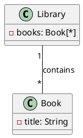
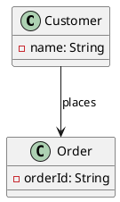
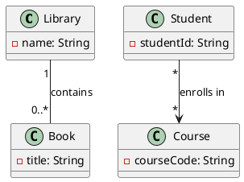
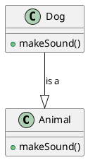
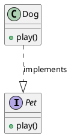
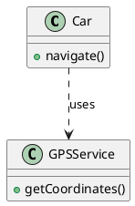
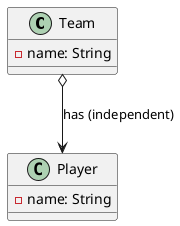
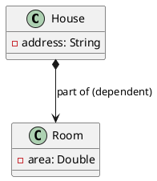
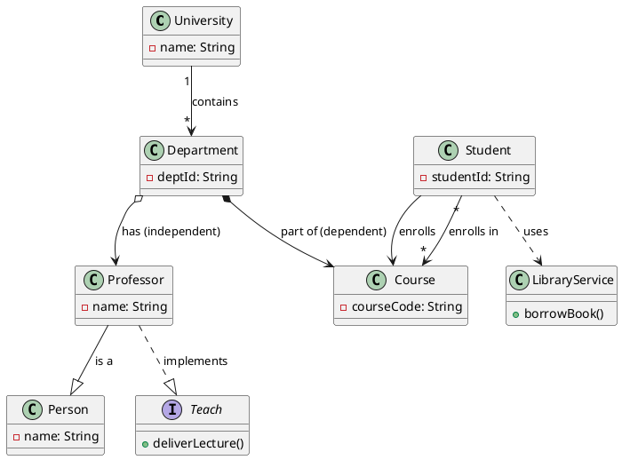

# UML 2.5.1 Relationships

## Document Overview
This document provides a professional, verified explanation of key UML 2.5.1 relationships, based on the official OMG UML 2.5.1 specification (Document Number: formal/2017-12-05, December 2017). The content has been fact-checked against the provided PDF ("formal-17-12-05.pdf"), ensuring alignment with the standard. Explanations are grouped logically, with textual descriptions, UML 2.5.1 semantics notes, and corresponding PlantUML code for visualization. Separate diagrams are used for clarity, but a combined example is included at the end.

References to specific sections and pages from the UML 2.5.1 specification are included for traceability. This guide focuses on structural relationships (e.g., associations, dependencies) as per the query context.

## 1. Association Relationships
Associations in UML 2.5.1 (Section 11.5) represent structural relationships between classifiers, classifying sets of links between instances. They are bidirectional by default but can specify navigability and ownership.

### Association ("Has-a")
A general structural relationship where instances of one classifier are linked to instances of another. It implies a semantic connection without implying ownership or lifecycle dependency.  
**UML 2.5.1 Semantics**: Associations classify links; each end has a type and multiplicity. If derived, marked with "/". (Pages 241-246)  
**PlantUML Code**:

### Directed Association ("One-way Has-a")
A unidirectional association where navigability is specified from one end to the other (one class can access the other, but not vice versa).  
**UML 2.5.1 Semantics**: Navigability is indicated by an arrow; non-navigable ends may be marked with "x". (Pages 243-244)  
**PlantUML Code**:

### Multiplicity ("How many")
Specifies the allowable number of instances in the relationship (e.g., 1, 0..*, *).  
**UML 2.5.1 Semantics**: Defined by lower and upper bounds; "*" means unlimited. Multiplicity constrains cardinality. (Section 7.5, Pages 32-35)  
**PlantUML Code**:

## 2. Inheritance & Implementation
These define taxonomic and contractual relationships (Section 9.2 for Generalization, Section 10.5 for Interfaces).

### Generalization ("Is-a")
A relationship where a specific classifier inherits features from a more general one.  
**UML 2.5.1 Semantics**: The specific classifier conforms to the general one; features are inherited. (Pages 141-145)  
**PlantUML Code**:

### Realization ("Implements")
A classifier realizes (implements) the contract defined by an interface.  
**UML 2.5.1 Semantics**: The realizing classifier provides implementations for the interface's operations. (Pages 213-219)  
**PlantUML Code**:

## 3. Dependency & Containment
Dependencies indicate reliance; containment specifies whole-part relationships (Section 7.7 for Dependencies, Section 11.5 for Aggregation/Composition).

### Dependency ("Uses-a")
A weak, temporary relationship where one element depends on another for its specification or implementation.  
**UML 2.5.1 Semantics**: Changes in the supplier may impact the client; often for method parameters. (Pages 79-82)  
**PlantUML Code**:

### Aggregation ("Has-a (independent)")
A whole-part relationship where parts can exist independently of the whole (shared aggregation).  
**UML 2.5.1 Semantics**: AggregationKind::shared; parts have independent lifecycles. (Pages 153-156, 244)  
**PlantUML Code**:

### Composition ("Part-of (dependent)")
A strong whole-part relationship where parts are destroyed when the whole is destroyed (composite aggregation).  
**UML 2.5.1 Semantics**: AggregationKind::composite; exclusive ownership, dependent lifecycle. (Pages 153-156, 244)  
**PlantUML Code**:

## Grouped Summary
1. **Association Relationships**  
   - Association: Structural "has-a" (bidirectional by default).  
   - Directed Association: Unidirectional navigability.  
   - Multiplicity: Constrains instance counts (e.g., 1, 0..*, *).  

2. **Inheritance & Implementation**  
   - Generalization: Taxonomic "is-a" inheritance.  
   - Realization: Contractual "implements" for interfaces.  

3. **Dependency & Containment**  
   - Dependency: Weak "uses-a" reliance.  
   - Aggregation: Shared "has-a" (independent parts).  
   - Composition: Owned "part-of" (dependent parts).  

## Combined University System Diagram
This example integrates all relationships in a University System (inspired by spec examples in Sections 7-11).

**PlantUML Code**:

**Description**: Demonstrates associations (contains, enrolls), multiplicity (1-to-*, *-to-*), generalization (Professor is a Person), realization (Professor implements Teach), dependency (Student uses LibraryService), aggregation (Department has Professors), and composition (Department owns Courses).  
**UML 2.5.1 Notes**: Compliant with notations in Sections 7.5 (multiplicity), 9.2 (generalization), 10.5 (realization), 7.7 (dependency), and 11.5 (aggregation/composition).

This document is self-contained and professional for educational or reference purposes. For full details, refer to the OMG UML 2.5.1 specification. If further customization is needed, provide details.
