## UML Relationships Tutorial

This tutorial provides a comprehensive guide to fundamental UML relationships, adhering to the UML 2.5.1 standards. We will use a consistent shopping cart system example to illustrate each concept.

-----

### 1. Association

**Concept:** Association is the most common and versatile relationship in UML. It represents a **structural connection** between two or more classifiers, indicating that instances of one class are linked to instances of another. It's a general-purpose, bidirectional link showing that one class "has" or "is connected to" another. The connection is loose, meaning the objects can exist independently.

**Notation:** A solid line connecting two classes. You can add a name to the association and role names at each end to specify the connection's purpose.

**Shopping Cart Example:** A `Customer` has an association with a `ShoppingCart`. The shopping cart exists for the customer, but it can exist independently of that specific customer.

**PlantUML:**

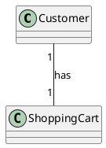

**Diagram:**

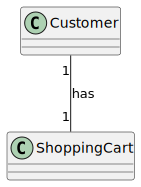

-----

### 2. Directed Association

**Concept:** This is a specialized form of association where the navigation is **one-way**. It signifies that the source class can access or use the target class, but not the other way around. This relationship is useful for modeling a one-way flow of information.

**Notation:** A solid line with a single open arrowhead pointing from the source class to the target class.

**Shopping Cart Example:** An `Order` class is created from a `ShoppingCart`. The `Order` needs to access the items from the `ShoppingCart`, but once the order is placed, the `ShoppingCart` doesn't need to know anything about the `Order`. The association is directed from `Order` to `ShoppingCart`.

**PlantUML:**

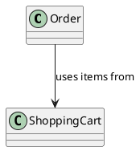

**Diagram:**

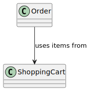

-----

### 3. Multiplicity

**Concept:** Multiplicity specifies the number of instances of one class that can be linked to a single instance of another class across an association. It is a constraint on the cardinality of the relationship, answering the question "how many?"

**Notation:** A number or a range is placed at the end of an association line, next to the class it applies to. Common notations include:

  * **1**: Exactly one.
  * **0..1**: Zero or one.
  * **1..**\*: One or more.
  * **\***: Zero or more.

**Shopping Cart Example:**

  * A `Customer` has exactly **one** `ShoppingCart` (`1`).
  * A `ShoppingCart` can contain **one or more** `LineItem` objects (`1..*`).
  * A `LineItem` represents exactly **one** `Product` (`1`).

-----

### 4. Aggregation

**Concept:** Aggregation is a **"whole-part" or "has-a" relationship** that represents a weaker form of association. The "part" objects can exist independently of the "whole" object. The whole is an aggregate of the parts, but their life cycles are not tied together.

**Notation:** A solid line with a **hollow diamond** on the side of the "whole" or aggregate class.

**Shopping Cart Example:** A `ShoppingCart` is an aggregation of `LineItem` objects. A `LineItem` (representing a specific product and quantity) can be moved to another cart or exist on its own without being tied to a specific cart's life cycle.

**PlantUML:**

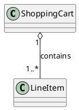

**Diagram:**

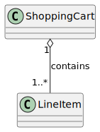

-----

### 5. Composition

**Concept:** Composition is a **stronger form of aggregation**. It is a strict **"whole-part" relationship** where the "part" objects cannot exist without the "whole" object. If the whole object is destroyed, the parts are also destroyed. This implies a strong life-cycle dependency.

**Notation:** A solid line with a **filled diamond** on the side of the "whole" class.

**Shopping Cart Example:** An `Order` is composed of `OrderLine` objects. The `OrderLine` objects (which specify the final price, tax, etc., at the time of purchase) are created for and owned by that specific `Order`. If the `Order` is deleted, all its `OrderLine` objects must also be deleted.

**PlantUML:**

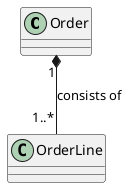

**Diagram:**

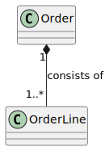

-----

### 6. Dependency

**Concept:** Dependency is a **"uses" relationship**. It indicates that a change in the definition of one class (the **supplier**) may affect another class (the **client**). It's a temporary or **non-structural** relationship, often a result of one class using another's methods or data to perform a task.

**Notation:** A dashed line with an open arrowhead pointing from the client to the supplier. A common stereotype is `«use»`.

**Shopping Cart Example:** A `Checkout` process depends on a `PaymentGateway` to complete a transaction. The `Checkout` class doesn't own or contain the `PaymentGateway`; it just uses its services. If the `PaymentGateway`'s interface changes, the `Checkout` class will need to be updated.

**PlantUML:**

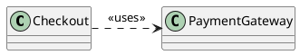

**Diagram:**
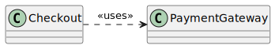

-----

### 7. Generalization (Inheritance)

**Concept:** Generalization is a **"is-a" relationship** between a more general classifier (superclass) and a more specific classifier (subclass). The subclass inherits the features (attributes and operations) of the superclass and can extend or override them.

**Notation:** A solid line with a **hollow, triangular arrowhead** pointing from the specific class to the general class.

**Shopping Cart Example:** A `Product` is a general class. You can create more specific classes like `DigitalProduct` and `PhysicalProduct` that **inherit** from `Product`. A `DigitalProduct` "is a" `Product`, and a `PhysicalProduct` "is a" `Product`.

**PlantUML:**

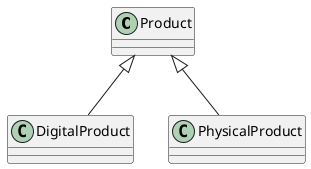

**Diagram:**
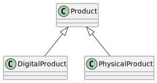

-----

### 8. Realization

**Concept:** Realization is a relationship between a classifier that specifies a **contract** (an interface) and a classifier that **implements** that contract. The implementing class guarantees to provide the behavior and structure defined by the interface.

**Notation:** A dashed line with a **hollow, triangular arrowhead** pointing from the realizing class to the interface.

**Shopping Cart Example:** You can define an interface called `ICart` with methods like `addItem()`, `removeItem()`, and `calculateTotal()`. A concrete `ShoppingCart` class would then **realize** this `ICart` interface, providing the actual code for those methods.

**PlantUML:**

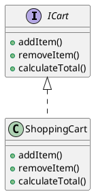

**Diagram:**
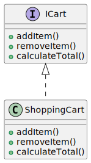
