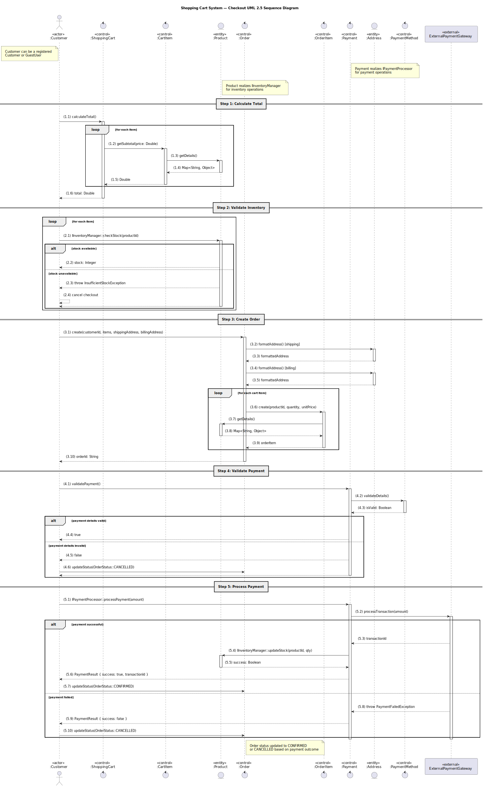

# UML 2.5.1 Sequence Diagram Tutorial: Modeling the Checkout Process in a Shopping Cart System

This tutorial provides a comprehensive guide to creating a Sequence Diagram compliant with UML 2.5.1 standards (Object Management Group specification, formal/2017-12-05, dated December 2017). Using the **shopping cart system** as a case study, it models the dynamic interactions during the **Checkout** process, integrating **interfaces** (`IPaymentProcessor`, `IInventoryManager`) and their realization relationships as defined in the Class Diagram. Sequence Diagrams illustrate time-ordered interactions between objects, complementing the static structure of the Class Diagram, which organizes elements into packages (User Management, Cart Management, Product Management, Order Management, Common Types). This tutorial targets developers, analysts, and system architects aiming to document and design system behavior effectively.

**Reference**: Consult the UML 2.5.1 specification at [https://www.omg.org/spec/UML/](https://www.omg.org/spec/UML/) for detailed guidance on sequence diagram constructs, including lifelines, messages, and combined fragments.

---

## Overview of Sequence Diagrams

In UML 2.5.1, Sequence Diagrams depict a system’s dynamic behavior by illustrating how objects (instances of classes) exchange messages over time. Key elements include:
- **Lifelines**: Represent objects or actors (e.g., `:Customer`, `:ShoppingCart`).
- **Messages**: Synchronous (`->`) or asynchronous (`-->`) calls between lifelines (e.g., `calculateTotal()`).
- **Activation Bars**: Indicate an object’s active processing state.
- **Combined Fragments**: Model control flows, such as `alt` for conditional branches or `loop` for iterations.
- **Interfaces**: Facilitate modular interactions via defined operations (e.g., `IPaymentProcessor::processPayment()`).

This Sequence Diagram focuses on the **Checkout** process, where a customer finalizes their cart, validates inventory, creates an order, and processes payment, aligning with the Class Diagram’s structure and prior Use Case and Activity Diagrams.

Tools like PlantUML enable programmatic diagram generation, suitable for integration into documentation, repositories, or wikis.

---

## Step 0: Alignment with Prior UML Diagrams

To ensure traceability, the Sequence Diagram is aligned with prior UML artifacts:
1. **Use Case Diagram**: Identifies the **Checkout** use case, involving actors (Customer) and system functions (e.g., validate cart, process payment).
2. **Activity Diagram**: Defines the Checkout workflow, including steps like cart validation, inventory checks, order creation, and payment processing.
3. **Class Diagram** (artifact_id: `bee63a00-29c1-4ee0-970a-aa4342f8963b`):
   - **Classes**: `Customer`, `ShoppingCart`, `CartItem`, `Product`, `Order`, `OrderItem`, `Payment`, `Address`, `PaymentMethod`.
   - **Interfaces**: `IPaymentProcessor` (realized by `Payment`), `IInventoryManager` (realized by `Product`).
   - **Enums**: `OrderStatus`, `PaymentStatus`.
   - **Packages**: User Management, Cart Management, Product Management, Order Management, Common Types.
4. The Sequence Diagram maps dynamic interactions to these static elements, focusing on the Checkout process.

This alignment ensures the diagram reflects the system’s functional, behavioral, and structural requirements.

---

## Step 1: Analyze the Checkout Process

The Checkout process, derived from the Use Case and Activity Diagrams, involves the following:
- **Actors**: `Customer` (either a registered `Customer` or `GuestUser` from the User Management package).
- **Entities**:
  - `ShoppingCart`: Validates cart contents and calculates the total cost.
  - `CartItem`: Provides item details and subtotals.
  - `Product`: Manages inventory checks and updates via `IInventoryManager`.
  - `Order`: Creates and manages the order, including items and status.
  - `OrderItem`: Represents products within an order.
  - `Payment`: Handles payment validation and processing via `IPaymentProcessor`.
  - `Address`: Supplies formatted shipping and billing addresses.
  - `PaymentMethod`: Validates payment details.
  - `ExternalPaymentGateway`: Processes payments externally.
- **Process Steps**:
  1. The customer initiates checkout by calculating the cart total.
  2. The system validates cart items and retrieves product details for pricing.
  3. Inventory is checked for each item to ensure availability.
  4. An order is created with customer details, items, and addresses.
  5. Payment details are validated, followed by payment processing through an external gateway.
  6. Inventory is updated, and the order status is set to `CONFIRMED` or `CANCELLED` based on payment outcome.
- **Interfaces**:
  - `IPaymentProcessor`: Defines `validatePayment()` and `processPayment()` for payment operations.
  - `IInventoryManager`: Defines `checkStock()` and `updateStock()` for inventory operations.

---

## Step 2: Define Lifelines

The lifelines, representing objects or actors in the Checkout process, are:
- `:Customer` (User Management package, instance of `Customer` or `GuestUser`).
- `:ShoppingCart` (Cart Management package).
- `:CartItem` (Cart Management package).
- `:Product` (Product Management package, realizing `IInventoryManager`).
- `:Order` (Order Management package).
- `:OrderItem` (Order Management package).
- `:Payment` (Order Management package, realizing `IPaymentProcessor`).
- `:Address` (User Management package, for shipping/billing addresses).
- `:PaymentMethod` (User Management package).
- `ExternalPaymentGateway` (external system interacting via `IPaymentProcessor`).

---

## Step 3: Specify Messages and Interactions

The interactions, as defined in the updated PlantUML script, include:
- `:Customer` calls `:ShoppingCart.calculateTotal()` to compute the total cost.
- `:ShoppingCart` iterates over `:CartItem` in a `loop` to calculate subtotals, invoking `:Product.getDetails()` for pricing information.
- `:Customer` validates inventory by calling `:Product.IInventoryManager::checkStock()` in a `loop`, with an `alt` fragment to handle stock availability or throw an `InsufficientStockException` (canceling checkout if unavailable).
- `:Customer` initiates `:Order.create(customerId, items, shippingAddress, billingAddress)`, with `:Order` calling `:Address.formatAddress()` for shipping and billing addresses.
- `:Order` creates `:OrderItem` instances in a `loop`, with each `:OrderItem` calling `:Product.getDetails()`.
- `:Customer` invokes `:Payment.validatePayment()`, which calls `:PaymentMethod.validateDetails()`.
- An `alt` fragment handles valid/invalid payment details, updating `:Order` status to `CANCELLED` if invalid.
- `:Customer` calls `:Payment.IPaymentProcessor::processPayment(amount: Double)`, which interacts with `ExternalPaymentGateway.processTransaction()`.
- An `alt` fragment manages payment success/failure:
  - On success, `:Payment` calls `:Product.IInventoryManager::updateStock()`, and `:Customer` updates `:Order` status to `CONFIRMED`.
  - On failure, an exception is thrown, and `:Order` status is set to `CANCELLED`.

---

## Step 4: Incorporate Interfaces

Interfaces ensure modularity:
- `IPaymentProcessor::validatePayment()` and `::processPayment()` are used for `:Payment` interactions, reflecting its realization in the Class Diagram.
- `IInventoryManager::checkStock()` and `::updateStock()` are used for `:Product` interactions, aligning with its realization.
- Interface operations are denoted with `::` to emphasize contract-based interactions.

---

## Step 5: Include Notes and Combined Fragments

- **Notes** clarify:
  - `:Customer` can represent a registered `Customer` or `GuestUser`.
  - `:Payment` realizes `IPaymentProcessor` for payment operations.
  - `:Product` realizes `IInventoryManager` for inventory operations.
  - `:Order` status updates to `CONFIRMED` or `CANCELLED` based on payment outcome.
- **Combined Fragments**:
  - `loop`: Iterates over cart items for subtotal calculations and inventory checks, and over order items during order creation.
  - `alt`: Handles conditional logic for stock availability (available/unavailable) and payment outcomes (success/failure).

---

## Step 6: Validate the Diagram

Validation ensures:
- Lifelines correspond to classes/interfaces in the Class Diagram (e.g., `:Payment` realizes `IPaymentProcessor`).
- Messages map to class operations (e.g., `calculateTotal()`, `validatePayment()`).
- Interactions align with the Checkout workflow from the Activity Diagram.
- UML 2.5.1 compliance is maintained, with correct notation for lifelines, messages, activation bars, and combined fragments.
- The diagram accurately reflects the provided PlantUML script for consistency.

Stakeholders should review the diagram to confirm its accuracy and completeness.

---

## Step 7: PlantUML Representation

[](checkout-process-sequence-diagram.svg)

The following PlantUML script defines the Sequence Diagram for the Checkout process:

```plantuml
@startuml
title Shopping Cart System — Checkout UML 2.5 Sequence Diagram

skinparam linetype polyline
skinparam Shadowing false
skinparam Padding 10
skinparam NodePadding 10
skinparam ComponentPadding 10

actor Customer as ":Customer" <<actor>>
control ShoppingCart as ":ShoppingCart" <<control>>
control CartItem as ":CartItem" <<control>>
entity Product as ":Product" <<entity>>
control Order as ":Order" <<control>>
control OrderItem as ":OrderItem" <<control>>
control Payment as ":Payment" <<control>>
entity Address as ":Address" <<entity>>
control PaymentMethod as ":PaymentMethod" <<control>>
participant Gateway as "ExternalPaymentGateway" <<external>>

note left of Customer
  Customer can be a registered
  Customer or GuestUser
end note
note right of Payment
  Payment realizes IPaymentProcessor
  for payment operations
end note
note right of Product
  Product realizes IInventoryManager
  for inventory operations
end note

== Step 1: Calculate Total ==
Customer -> ShoppingCart: (1.1) calculateTotal()
activate ShoppingCart
loop for each item
  ShoppingCart -> CartItem: (1.2) getSubtotal(price: Double)
  activate CartItem
  CartItem -> Product: (1.3) getDetails()
  activate Product
  Product --> CartItem: (1.4) Map<String, Object>
  deactivate Product
  CartItem --> ShoppingCart: (1.5) Double
  deactivate CartItem
end
ShoppingCart --> Customer: (1.6) total: Double
deactivate ShoppingCart

== Step 2: Validate Inventory ==
loop for each item
  Customer -> Product: (2.1) IInventoryManager::checkStock(productId)
  activate Product
  alt stock available
    Product --> Customer: (2.2) stock: Integer
  else stock unavailable
    Product --> Customer: (2.3) throw InsufficientStockException
    Customer --> Customer: (2.4) cancel checkout
    return
  end
  deactivate Product
end

== Step 3: Create Order ==
Customer -> Order: (3.1) create(customerId, items, shippingAddress, billingAddress)
activate Order
Order -> Address: (3.2) formatAddress() [shipping]
activate Address
Address --> Order: (3.3) formattedAddress
deactivate Address
Order -> Address: (3.4) formatAddress() [billing]
activate Address
Address --> Order: (3.5) formattedAddress
deactivate Address
loop for each cart item
  Order -> OrderItem: (3.6) create(productId, quantity, unitPrice)
  activate OrderItem
  OrderItem -> Product: (3.7) getDetails()
  activate Product
  Product --> OrderItem: (3.8) Map<String, Object>
  deactivate Product
  OrderItem --> Order: (3.9) orderItem
  deactivate OrderItem
end
Order --> Customer: (3.10) orderId: String
deactivate Order

== Step 4: Validate Payment ==
Customer -> Payment: (4.1) validatePayment()
activate Payment
Payment -> PaymentMethod: (4.2) validateDetails()
activate PaymentMethod
PaymentMethod --> Payment: (4.3) isValid: Boolean
deactivate PaymentMethod
alt payment details valid
  Payment --> Customer: (4.4) true
else payment details invalid
  Payment --> Customer: (4.5) false
  Customer -> Order: (4.6) updateStatus(OrderStatus::CANCELLED)
  return
end
deactivate Payment

== Step 5: Process Payment ==
Customer -> Payment: (5.1) IPaymentProcessor::processPayment(amount)
activate Payment
Payment -> Gateway: (5.2) processTransaction(amount)
activate Gateway
alt payment successful
  Gateway --> Payment: (5.3) transactionId
  Payment -> Product: (5.4) IInventoryManager::updateStock(productId, qty)
  activate Product
  Product --> Payment: (5.5) success: Boolean
  deactivate Product
  Payment --> Customer: (5.6) PaymentResult { success: true, transactionId }
  Customer -> Order: (5.7) updateStatus(OrderStatus::CONFIRMED)
else payment failed
  Gateway --> Payment: (5.8) throw PaymentFailedException
  Payment --> Customer: (5.9) PaymentResult { success: false }
  Customer -> Order: (5.10) updateStatus(OrderStatus::CANCELLED)
end
deactivate Gateway
deactivate Payment

note right of Order
  Order status updated to CONFIRMED
  or CANCELLED based on payment outcome
end note

@enduml
