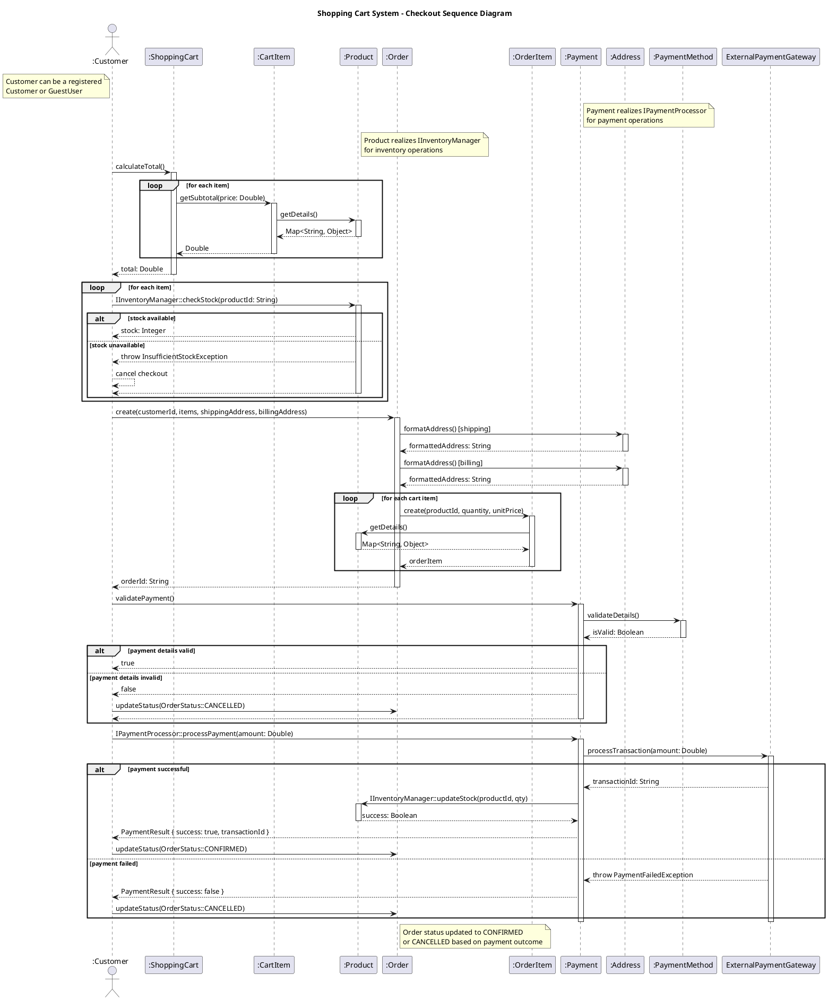

# UML 2.5.1 Sequence Diagram Tutorial: Modeling the Checkout Process in a Shopping Cart System
This module provides a comprehensive guide to creating a Sequence Diagram adhering to UML 2.5.1 standards (as defined by the Object Management Group specification, formal/2017-12-05, dated December 2017). Using the **shopping cart system** as a practical example, this tutorial models the dynamic interactions during the **Checkout** process, incorporating **interfaces** (`IPaymentProcessor`, `IInventoryManager`) and their realization relationships from the Class Diagram (artifact_id: `bee63a00-29c1-4ee0-970a-aa4342f8963b`). Sequence Diagrams depict the time-ordered interactions between objects, complementing the static structure defined in the Class Diagram (with packages: User Management, Cart Management, Product Management, Order Management, Common Types). This tutorial is designed for developers, analysts, and designers to document and design the system's behavior effectively, incorporating feedback from your manager’s reviewed script.

**Pro Tip:** Refer to the UML 2.5.1 specification at [https://www.omg.org/spec/UML/](https://www.omg.org/spec/UML/) for insights into sequence diagram elements (e.g., lifelines, messages, combined fragments) to ensure modeling precision.

---

## Introduction to Sequence Diagrams
Sequence Diagrams in UML 2.5.1 model the dynamic behavior of a system by showing how objects (instances of classes) interact via messages over time. Key elements include:
- **Lifelines**: Represent objects or actors (e.g., `:Customer`, `:ShoppingCart`).
- **Messages**: Synchronous (`->`) or asynchronous (`-->`) calls between lifelines (e.g., `calculateTotal()`).
- **Activation Bars**: Indicate when an object is active/processing.
- **Combined Fragments**: Model control flow (e.g., `alt` for alternatives, `loop` for iteration).
- **Interfaces**: Show interactions via interface operations (e.g., `IPaymentProcessor::processPayment()`).
This diagram focuses on the **Checkout** process, where a Customer finalizes their cart, validates inventory, creates an order, and processes payment, aligning with the Class Diagram’s structure (e.g., classes, interfaces, and relationships).

Tools like PlantUML enable programmatic diagram generation, ideal for embedding in documentation or wikis.

---

## Step 0: Transition from Prior UML Diagrams
To ensure traceability, align the Sequence Diagram with prior UML diagrams and your manager’s feedback:
1. Review the **Use Case Diagram** to identify the **Checkout** use case (involving Customer, Shopping Cart, Order, Payment).
2. Extract dynamic behavior from the **Activity Diagram** (e.g., Checkout workflow: validate cart, check inventory, process payment, confirm order).
3. Map to the **Class Diagram** (artifact_id: `bee63a00-29c1-4ee0-970a-aa4342f8963b`):
   - **Classes**: `Customer`, `ShoppingCart`, `CartItem`, `Product`, `Order`, `OrderItem`, `Payment`, `Address`, `PaymentMethod`.
   - **Interfaces**: `IPaymentProcessor` (realized by `Payment`), `IInventoryManager` (realized by `Product`).
   - **Enums**: `OrderStatus`, `PaymentStatus`.
   - **Packages**: User Management, Cart Management, Product Management, Order Management, Common Types.
4. Incorporate your manager’s reviewed script, which defines the Checkout process with precise interactions and interface usage.
5. Focus on interactions involving `:Customer`, `:ShoppingCart`, `:CartItem`, `:Product`, `:Order`, `:OrderItem`, `:Payment`, `:Address`, `:PaymentMethod`, and `ExternalPaymentGateway`.
This step ensures the Sequence Diagram reflects the system’s static structure, functional requirements, and manager’s specifications.

---

## Step 1: Analyze the Checkout Process
Based on the Use Case, Activity Diagrams, and your manager’s script, the Checkout process involves:
- **Actors**: `Customer` (initiates checkout, can be a registered `Customer` or `GuestUser`).
- **Entities**:
  - `ShoppingCart`: Validates cart contents and calculates total.
  - `CartItem`: Provides item details and subtotals.
  - `Product`: Checks and updates inventory via `IInventoryManager`.
  - `Order`: Creates order, assigns items, and updates status.
  - `OrderItem`: Represents products in the order.
  - `Payment`: Processes payment via `IPaymentProcessor`.
  - `Address`: Provides shipping/billing details.
  - `PaymentMethod`: Supplies payment details.
  - `ExternalPaymentGateway`: External system for payment processing.
- **Steps** (as per your manager’s script):
  1. Customer initiates checkout by calling `calculateTotal()` on `ShoppingCart`.
  2. `ShoppingCart` iterates over `CartItem` to compute subtotals, retrieving prices from `Product`.
  3. Customer validates inventory by calling `IInventoryManager::checkStock()` on `Product`.
  4. If stock is unavailable, checkout is canceled.
  5. Customer creates an `Order`, passing customer ID, items, and addresses.
  6. `Order` formats shipping and billing addresses via `Address` and creates `OrderItem` instances, referencing `Product`.
  7. Customer validates payment via `Payment.validatePayment()` and `PaymentMethod.validateDetails()`.
  8. If payment details are invalid, `Order` status is set to `CANCELLED`.
  9. Customer processes payment via `IPaymentProcessor::processPayment()`, interacting with `ExternalPaymentGateway`.
  10. If payment succeeds, `Product` updates stock, and `Order` status is set to `CONFIRMED`; otherwise, it’s set to `CANCELLED`.

---

## Step 2: Identify Lifelines
Lifelines represent objects or actors involved in the Checkout process, as defined in your manager’s script:
- `:Customer` (from User Management package, instance of `Customer` or `GuestUser`).
- `:ShoppingCart` (from Cart Management package).
- `:CartItem` (from Cart Management package).
- `:Product` (from Product Management package, realizing `IInventoryManager`).
- `:Order` (from Order Management package).
- `:OrderItem` (from Order Management package).
- `:Payment` (from Order Management package, realizing `IPaymentProcessor`).
- `:Address` (from User Management package, for shipping/billing).
- `:PaymentMethod` (from User Management package).
- `ExternalPaymentGateway` (external system interacting via `IPaymentProcessor`).

**Note**: `Administrator` and `IInventoryManager` (for Administrator) are not involved in Checkout, so they are excluded.

---

## Step 3: Define Messages and Interactions
Messages, as per your manager’s script, include:
- `:Customer -> :ShoppingCart: calculateTotal()` to compute cart total.
- `:ShoppingCart -> :CartItem: getSubtotal(price: Double)` in a `loop` for each item, with `:CartItem -> :Product: getDetails()` to retrieve pricing.
- `:Customer -> :Product: IInventoryManager::checkStock(productId: String)` in a `loop` to validate stock, with `alt` for available/unavailable stock.
- `:Customer -> :Order: create(customerId, items, shippingAddress, billingAddress)` to create the order.
- `:Order -> :Address: formatAddress()` for shipping and billing addresses.
- `:Order -> :OrderItem: create(productId, quantity, unitPrice)` in a `loop`, with `:OrderItem -> :Product: getDetails()`.
- `:Customer -> :Payment: validatePayment()`, with `:Payment -> :PaymentMethod: validateDetails()`.
- `alt` fragment for valid/invalid payment details, updating `:Order` status to `CANCELLED` if invalid.
- `:Customer -> :Payment: IPaymentProcessor::processPayment(amount: Double)`, with `:Payment -> ExternalPaymentGateway: processTransaction()`.
- `alt` fragment for payment success/failure, with `:Payment -> :Product: IInventoryManager::updateStock()` on success, and `:Customer -> :Order: updateStatus()` to `CONFIRMED` or `CANCELLED`.

---

## Step 4: Incorporate Interfaces
- Use `IPaymentProcessor::validatePayment()` and `::processPayment()` for `:Payment` interactions.
- Use `IInventoryManager::checkStock()` and `::updateStock()` for `:Product` interactions.
- Denote interface calls with `::` to align with the Class Diagram’s realization relationships.

---

## Step 5: Add Notes and Fragments
- Notes clarify:
  - `:Customer` can be a registered `Customer` or `GuestUser`.
  - `:Payment` realizes `IPaymentProcessor`.
  - `:Product` realizes `IInventoryManager`.
  - `:Order` status updates based on payment outcome.
- Combined fragments:
  - `loop` for iterating over cart items and order items.
  - `alt` for stock availability and payment success/failure.

---

## Step 6: Validate the Diagram
Ensure:
- Lifelines map to Class Diagram classes/interfaces (e.g., `:Payment` realizes `IPaymentProcessor`).
- Messages align with class operations (e.g., `calculateTotal()`, `processPayment()`).
- Interactions reflect the Checkout workflow from the Activity Diagram.
- UML 2.5.1 compliance (correct lifeline, message, and fragment notation).
- Matches your manager’s script exactly for accuracy.
Walk through with stakeholders to validate and iterate as needed.

---

## Step 7: Example PlantUML Representation

Below is the PlantUML script for the Checkout Sequence Diagram, as provided by your manager, modeling interactions among `:Customer`, `:ShoppingCart`, `:CartItem`, `:Product`, `:Order`, `:OrderItem`, `:Payment`, `:Address`, `:PaymentMethod`, and `ExternalPaymentGateway`.

