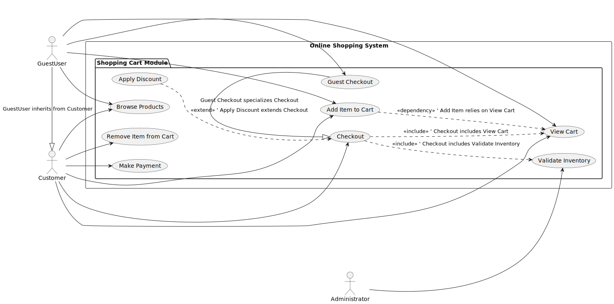

# UML 2 Use Case Diagram Tutorial: Modeling a Shopping Cart System

This module provides a comprehensive guide to creating a Use Case Diagram following UML 2 standards, using a **shopping cart system** as a practical example. Use Case Diagrams are essential for capturing the functional requirements of a system by illustrating interactions between actors and use cases. This tutorial is designed for developers, analysts, and designers aiming to document system behavior effectively.

---

## Introduction to Use Case Diagrams

A Use Case Diagram visually represents the interactions between external actors and the system’s functionalities, known as use cases. It serves as a high-level blueprint, focusing on what the system does from the user's perspective, rather than how it is implemented. UML 2 standardizes these diagrams to ensure clarity and consistency across projects.

Tools like PlantUML can be used to generate diagrams programmatically, making them ideal for embedding in GitHub Markdown files or wikis.

---

## Step 1: Analyze System Requirements

Begin by defining the system’s scope and identifying its functional requirements. For the shopping cart system:

- Users can browse available products.
- Users can add or remove items from the cart.
- Users can view the cart’s contents.
- Users can proceed to checkout and complete payment.
- Administrators can manage product inventory and details.

This step ensures all key functionalities are accounted for before modeling begins.

---

## Step 2: Identify Actors

Actors are external entities that interact with the system, depicted outside the system boundary. For the shopping cart system:

- **Customer**: Performs shopping activities such as browsing, adding items, and checking out.
- **Administrator**: Manages product inventory and system updates.
- **Guest User**: A specialized Customer role with limited access (e.g., browsing and adding items without login), inheriting from Customer via generalization.

Name actors based on roles, not individuals, and consider both human and non-human entities if applicable.

---

## Step 3: Define Use Cases

Use cases represent specific, goal-oriented interactions provided by the system, yielding observable results for actors. For the shopping cart system:

- Browse Products
- Add Item to Cart
- Remove Item from Cart
- View Cart
- Checkout
- Make Payment
- Manage Products
- Validate Inventory
- Apply Discount
- Guest Checkout

**Best Practice**: Phrase use cases as verb-noun pairs (e.g., "Add Item to Cart") and ensure they reflect meaningful actions from the actor’s perspective, excluding internal implementation details.

---

## Step 4: Establish the System Boundary

Draw a rectangle to define the system’s scope, labeled as "Online Shopping System." Place all use cases within this boundary, with actors positioned outside. This boundary clearly delineates the system’s responsibilities.

---

## Step 5: Position Use Cases

Inside the system boundary, represent each use case as an oval with a descriptive label. Organize related use cases logically:

- Group customer-facing use cases (e.g., within a "Shopping Cart Module" package).
- Place administrative use cases separately if needed for clarity.

---

## Step 6: Associate Actors with Use Cases

Draw solid lines (associations) from actors to the use cases they interact with:

- **Customer** → Browse Products, Add Item to Cart, Remove Item from Cart, View Cart, Checkout, Make Payment
- **Guest User** → Browse Products, Add Item to Cart, View Cart, Guest Checkout (inherits Customer associations)
- **Administrator** → Manage Products, Validate Inventory

Associations indicate which actors can trigger specific use cases.

---

## Step 7: Incorporate Relationships

Enhance the diagram with UML relationships to reflect dependencies:

- **Include** (<<include>>): Mandatory sub-functionality (e.g., "Checkout" includes "View Cart" and "Validate Inventory").
- **Extend** (<<extend>>): Optional or conditional behavior (e.g., "Apply Discount" extends "Checkout").
- **Generalization**: Inheritance between actors (e.g., Guest User generalizes from Customer) or use cases (e.g., Guest Checkout specializes Checkout).
- **Dependency** (<<dependency>>): Rare, used to show one use case relying on another without inclusion or extension (e.g., "Add Item to Cart" depends on "View Cart").

Use relationships judiciously to maintain diagram readability.

---

## Step 8: Validate the Diagram

Review the diagram to ensure:

- All actors and use cases align with the requirements.
- Relationships are semantically correct per UML 2.
- The layout is uncluttered and easy to interpret.

Iterate based on feedback or evolving requirements.

---

## Step 9: Document Use Case Descriptions

A use case description is a detailed textual narrative that elaborates on each use case, outlining the sequence of actions, interactions, and outcomes between an actor and the system. It includes preconditions, postconditions, main success scenarios, and alternative flows or exceptions. Below is an example for the "Checkout" use case in a structured table format:

| **Use Case Name** | Checkout |
|-------------------|----------|
| **Actors**        | Customer, Guest User |
| **Description**   | Allows a user to complete the purchase of items in their shopping cart by processing payment and confirming the order. |
| **Preconditions** | User has items in the shopping cart. <br> User is logged in (for Customer) or proceeds as a guest (for Guest User). |
| **Postconditions**| Order is successfully placed, and payment is processed, or the transaction is canceled. |
| **Main Success Scenario** | 1. User selects "Checkout" from the View Cart page. <br> 2. System displays the order summary, including items, quantities, prices, and payment options. <br> 3. User enters payment details (e.g., credit card information or payment service credentials). <br> 4. System validates payment details and checks inventory availability. <br> 5. System processes the payment and confirms the order. <br> 6. User receives an order confirmation with details (e.g., order number, estimated delivery). |
| **Alternative Flows** | **A1: Payment Failure** <br> - At step 4, if payment fails (e.g., insufficient funds or invalid card), the system notifies the user and prompts them to re-enter payment details or choose another payment method. Returns to step 3. <br> **A2: Guest Checkout** <br> - If the user is a Guest User, the system prompts for an email address for order confirmation and does not require account login. Continues from step 2. |
| **Exceptions**    | **E1: Inventory Unavailable** <br> - At step 4, if any item is out of stock, the system notifies the user, removes the unavailable item from the cart, and prompts the user to continue or cancel the checkout process. |
| **Frequency**     | Frequent, triggered whenever a user completes a purchase. |
| **Assumptions**   | The system is online, and payment processing services are operational. |
| **Notes**         | The Checkout use case includes "View Cart" and "Validate Inventory" as mandatory sub-functionalities and may be extended by "Apply Discount" for promotional offers. |

Document each use case similarly in a table or structured format for clarity, aiding requirements analysis and design.

---

## Example: PlantUML Representation

[](use-case-diagram.svg)

Below is a PlantUML script to generate the complete Use Case Diagram for the shopping cart system. Use a PlantUML renderer to visualize it.

```plantuml
@startuml
left to right direction
'-----------------------
' Actors
'-----------------------
actor Customer
actor Administrator
actor GuestUser
GuestUser -|> Customer : GuestUser inherits from Customer
'-----------------------
' System Boundary
'-----------------------
rectangle "Online Shopping System" {
  '-----------------------
  ' Package for Grouping
  '-----------------------
  package "Shopping Cart Module" {
    '-----------------------
    ' Use Cases
    '-----------------------
    usecase "Browse Products" as UC1
    usecase "Add Item to Cart" as UC2
    usecase "Remove Item from Cart" as UC3
    usecase "View Cart" as UC4
    usecase "Checkout" as UC5
    usecase "Make Payment" as UC6
    usecase "Validate Inventory" as UC7
    usecase "Apply Discount" as UC8
    usecase "Guest Checkout" as UC9
    UC9 -|> UC5 : Guest Checkout specializes Checkout
  }
}
'-----------------------
' Actor-Use Case Associations
'-----------------------
Customer --> UC1
Customer --> UC2
Customer --> UC3
Customer --> UC4
Customer --> UC5
Customer --> UC6
GuestUser --> UC1
GuestUser --> UC2
GuestUser --> UC4
GuestUser --> UC9
Administrator --> UC7
'-----------------------
' Relationships
'-----------------------
UC5 ..> UC4 : <<include>> ' Checkout includes View Cart
UC5 ..> UC7 : <<include>> ' Checkout includes Validate Inventory
UC8 ..> UC5 : <<extend>> ' Apply Discount extends Checkout
UC2 ..> UC4 : <<dependency>> ' Add Item relies on View Cart
@enduml
